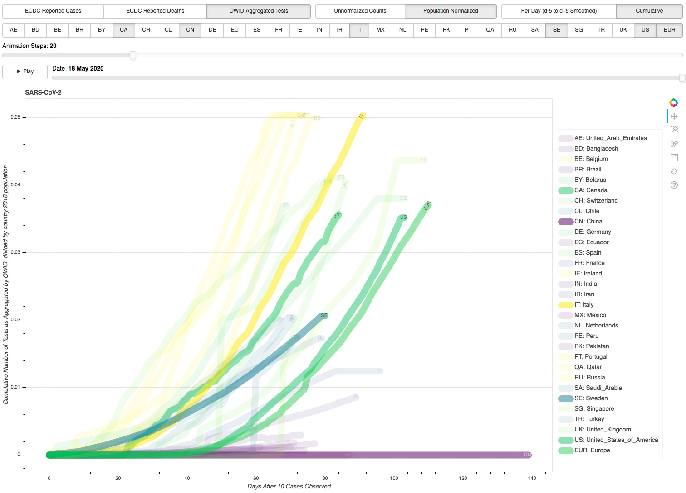

# Docker

lets one make a *Dockerfile > Image > Container*
- which defines an environment where an executable can run
- that can be ported over to another machine running docker 

## <a href="http://ec2-54-147-151-121.compute-1.amazonaws.com/app3">Bokeh Server Environment</a>

- Bokeh server running `app.py` 
- in Conda/Python/Bokeh container
- on a simple Amazon EC2 instance

## Setup

1. create a [dockerhub](https://hub.docker.com/) user account
2. download and install [docker desktop](https://www.docker.com/products/docker-desktop)
3. create a [Dockerfile](Dockerfile) (named "Dockerfile")
   - `ls /DIR/YOU/PUT/THE/DOCKERFILE/IN/` minimally returns `Dockerfile`
4. create an *Image*
   1. `cd /DIR/YOU/PUT/THE/DOCKERFILE/IN/`
   2. `docker build --tag winter4green/bokeh:latest .`
      - `docker build --tag imagename:version .`
      - `docker build --tag username/appname:version .`
   3. `docker image ls`

     |REPOSITORY        |TAG   |IMAGE ID    |    CREATED|  SIZE|
     |------------------|------|------------|-----------|------|
     |winter4green/bokeh|latest|8e6d275e9b8a|4 weeks ago|2.68GB|

5. publish the *Image*
   1. `docker login --username=winter4green` <!--- #(!) -->
   2. `docker tag 8e6d275e9b8a winter4green/bokeh`
   3. `docker push winter4green/bokeh`
6. create an EC2 instance
   - `ssh -i PATH/TO/YOUR.pem ec2-user@ec2-XXX-YYY-ZZZ-AAA.compute-1.amazonaws.com`
7. install the image on the instance
   1. `sudo yum update -y`
   2. `sudo yum install -y docker`
   3. `sudo service docker start`
   4. `sudo usermod -aG docker ec2-user`
   5. `docker info`
   6. `docker pull winter4green/bokeh`

## Launch

`docker run -it -p 80:5006 -v /home/ec2-user:/usr/src/app --name BokehServer winter4green/bokeh:latest`

- `-p` maps Bokeh's default port 5006 to the public address

  `http://ec2-XXX-YYY-ZZZ-AAA.compute-1.amazonaws.com/app:80`
- `-v` persists any changes made in the container's `/usr/src/app` directory (see [WORKDIR](Dockerfile))

  in the copied `ec2-XXX-YYY-ZZZ-AAA.compute-1.amazonaws.com/home/ec2-user/` directory (see [COPY](Dockerfile))
- the result is a `/bin/bash` call (see [CMD](Dockerfile)) that puts us in the container and we can then call
  - `conda activate py37`
  - `bokeh serve --allow-websocket-origin=ec2-XXX-YYY-ZZZ-AAA.compute-1.amazonaws.com --show app.py`

To avoid the service stopping upon a broken pipe, however, we actually run this as
- `docker run -it -p 80:5006 -v /home/ec2-user:/usr/src/app --name BokehServer winter4green/bokeh:latest`
- `exit`
- `docker start BokehServer`
- `docker exec -it BokehServer /bin/bash -c`
  - `"source ~/.bashrc &&`
  - `conda activate py37 &&`
  - `bokeh serve --allow-websocket-origin=ec2-XXX-YYY-ZZZ-AAA.compute-1.amazonaws.com --show app.py" &`

<!---
docker exec -it BokehServer /bin/bash -c "source ~/.bashrc && conda activate py37 && bokeh serve --allow-websocket-origin=ec2-54-147-151-121.compute-1.amazonaws.com --show app3.py" &
-->

## Clean Up

Given the backgrounding with `&`, to keep things clean we can
- `ps aux | grep -i docker`
- `sudo kill -9 <pid>`

And a final remove can be done with
- `docker ps --all`
- `docker rm --force BokehServer`

