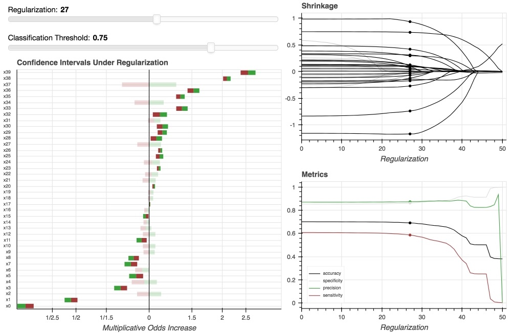
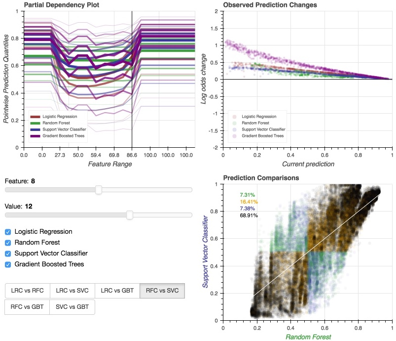
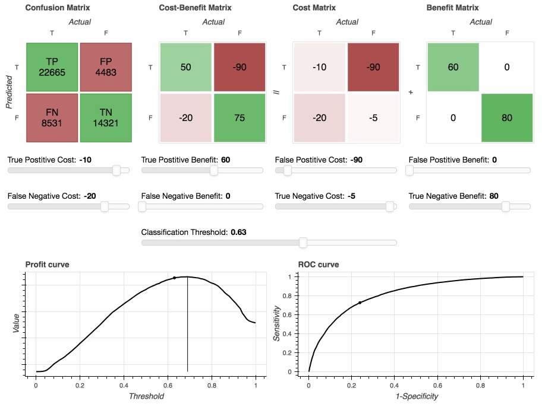
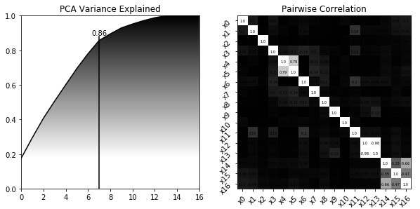
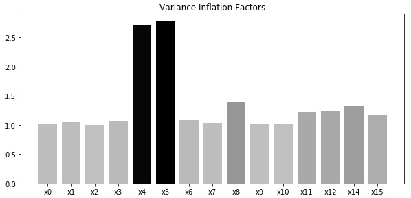
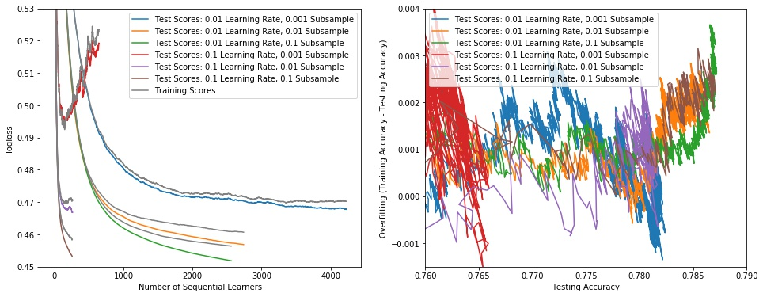
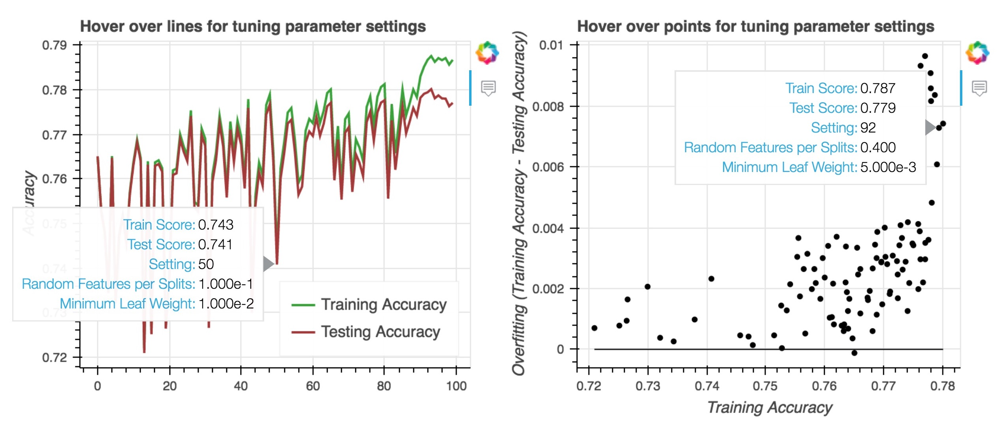
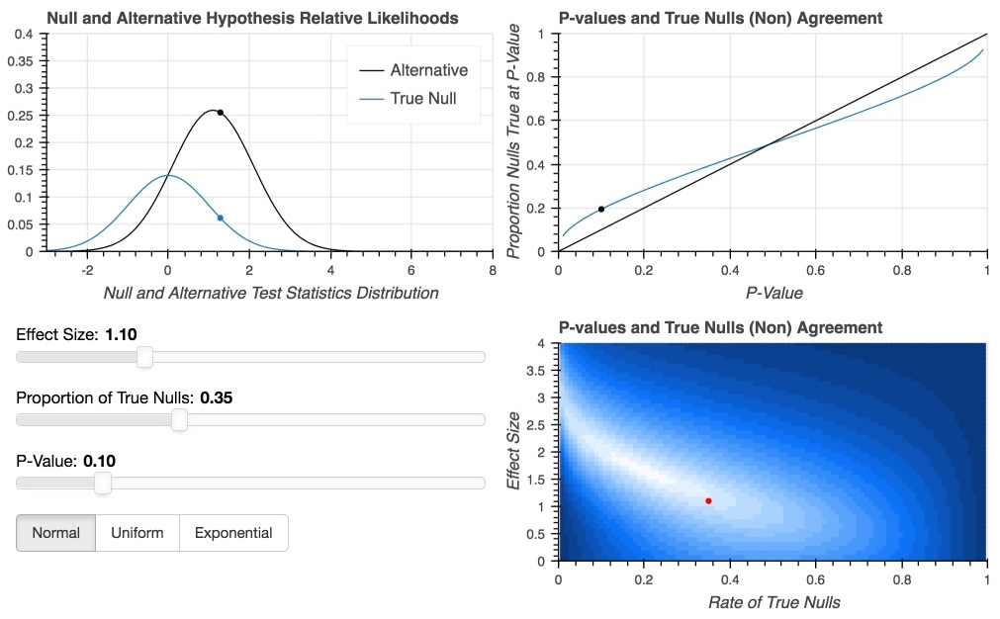

A# Data Analysis with Python

To see data analysis work done using the R programming language
please visit the [Model-Based Recursive Partitioning project](https://github.com/pointOfive/Home/tree/master/Code#r)
on the [coding page](https://github.com/pointOfive/Home/tree/master/Code#coding). This page
provides the following python-based data analysis examples:

- [Data Pipelining Functionality](#data-pipelining-functionality)
- [Regularized Confidence Intervals](#classical-meets-modern)
- [Interpreting Black-Box Models](#the-black-box-myth)
- [Decision Making with Profit Curves](#the-black-box-myth)
- [The Role of Experimental Design](#interpreting-feature-effects)
- [Setting Model Tuning Parameters](#selecting-model-tuning-parameters)
- [Webscrapping Database Server](https://github.com/pointOfive/Home/tree/master/Compute#serverworkers-paradigm)
- [Spark NLP Clustering Pipeline](https://github.com/pointOfive/Home/tree/master/Compute#emr-distributed-computing-paradigm)
- [Interpreting P-Values Correctly](#data-pipelining-functionality)


## Data Pipelining Functionality

The `Scikit-Learn` `Pipeline` package
facilitates data processing and transformation within a cross validation
context by providing `pipeline` objects that envoke a series of `.transform`
methods as part of `.fit` and `.predict` calls. 
This functionality simplifies and abstracts the
data modeling process, but the capabilities available out of the box
leave some things to be desired; namely, the built-in `Transforer` objects
do not provide the full control that an analyst might require.
I have therefore amended and wrapped these functionalities in my own
`Transformer` class objects which provide 


<details>
<summary>
customized handing of missing data columns
</summary>

<br>

```python
from sklearn.base import BaseEstimator,TransformerMixin
from statsmodels.regression.linear_model import OLS
from statsmodels.api import Logit, add_constant
from sklearn.preprocessing import StandardScaler, Imputer
import pandas as pd
import numpy as np
from scipy import stats
stats.chisqprob = lambda chisq, df: stats.chi2.sf(chisq, df)

# checking missingness is a bit tricky
isnan = np.vectorize(lambda x: x == 'nan' if type(x) == str else x is np.nan or np.isnan(x))

class add_missing_indicator(BaseEstimator,TransformerMixin):
    """add missingness column"""

    def __init__(self, colnames, to_be_transformed):
        """np.array: of column names (matching X)                                                                                                             
           list: of column names to be standardized"""
    def __init__(self, colnames, cols_to_change):
        self.colnames = colnames
        self.cols_to_change = cols_to_change

    def fit(self, X, Y=None):
        return self

    def transform(self, X):
        self.endcolnames = self.colnames.copy()
        XX = np.zeros((X.shape[0],X.shape[1]+len(self.cols_to_change)), dtype="object")
        XX[:,:-len(self.cols_to_change)] = X.copy()
        for i,c in enumerate(self.cols_to_change):
            XX[:, X.shape[1]+i] = isnan(X[:,self.colnames==c].flatten())
            self.endcolnames = np.array(self.endcolnames.tolist() + [c+"_missing"])
        return XX

class impute_continuous(BaseEstimator,TransformerMixin):
    """Fill missing with median -- wraps sklearn.Imputer"""

    def __init__(self, colnames, to_be_transformed, power=2):
        """np.array: of column names (matching X)                                                                                                             
           list: of column names to impute missing with median"""
    def __init__(self, colnames, to_be_transformed):
        self.colnames = colnames
        self.to_be_transformed = to_be_transformed.copy()
        self.impute = Imputer(strategy="median")

    def fit(self, X, Y=None):
        Xc = X[:, self.to_be_transformed]
        self.endcolnames = np.array(self.colnames[self.to_be_transformed].tolist() + self.colnames[False == self.to_be_transformed].tolist())
        self.impute.fit(Xc)
        return self

    def transform(self, X):
        Xc = X[:,self.to_be_transformed].copy()
        Xd = X[:, False==self.to_be_transformed].copy()
        Xcc = self.impute.transform(Xc)
        X = np.zeros([Xcc.shape[0],Xcc.shape[1]+Xd.shape[1]], dtype="object")
        X[:,:-Xd.shape[1]] = Xcc
        X[:,Xcc.shape[1]:] = Xd
        return X.astype(float)        
```

</details>


<details>
<summary>
full control of indicator variable creation
</summary>

<br>


```python
class create_indicators(BaseEstimator,TransformerMixin):
    """make indicators out of categorical"""

    def __init__(self, colnames, cols_to_change, thresh, remove):
        """np.array: of column names (matching X)                                                                                                             
           list: of column names to be standardized                                                                                                           
           threshold: minimum number of appearances                                                                                                           
           list of lists: levels to ignore for each column being standardized"""
        self.colnames = colnames
        self.cols_to_change = cols_to_change
        self.thresh = thresh
        self.cols_to_change_levels = []
        self.remove = remove

    def fit(self, X, Y=None):
        fit_df = pd.DataFrame(X, columns=self.colnames)
        for i,c in enumerate(self.cols_to_change):
            tmp = fit_df.groupby(c).size()
            tmp = tmp[tmp>self.thresh[i]].index.tolist()
            tmp = [cc for cc in tmp if cc not in self.remove[i]]
            self.cols_to_change_levels.append(tmp)
        return self

    def transform(self, X):
        self.endcolnames = self.colnames.copy()
        XX = X.copy()
        for i,c in enumerate(self.cols_to_change):
            col = np.arange(len(self.endcolnames))[self.endcolnames==c][0]
            XX = np.zeros((X.shape[0],X.shape[1]+len(self.cols_to_change_levels[i])),dtype="object")
            XX[:,:-len(self.cols_to_change_levels[i])] = X.copy()
            for j,l in enumerate(self.cols_to_change_levels[i]):
                XX[:, X.shape[1]+j] = (XX[:, col] == l).flatten()
                self.endcolnames = np.array(self.endcolnames.tolist() + [c+"_"+str(l)])
            X = XX.copy()
        for c in self.cols_to_change:
            XX = XX[:,self.endcolnames != c].copy()
            self.endcolnames = self.endcolnames[self.endcolnames != c]
        return XX.astype(float)
```

</details>

<details>
<summary>
selective and partial normalization capabilities
</summary>

<br>

```python
class standardize_continuous(BaseEstimator,TransformerMixin):
    """standardize -- wraps sklearn.StandardScaler"""

    def __init__(self, colnames, to_be_transformed):
        """np.array: of column names (matching X)                                                                                                             
           list: of column names to be standardized"""
        self.colnames = colnames
        self.to_be_transformed = to_be_transformed.copy()
        self.standardize = StandardScaler()

    def fit(self, X, Y=None):
        Xc = X[:, self.to_be_transformed]
        self.endcolnames = np.array(self.colnames[self.to_be_transformed].tolist() + self.colnames[False == self.to_be_transformed].tolist())
        self.standardize.fit(Xc)
        return self

    def transform(self, X):
	Xc = X[:,self.to_be_transformed].copy()
        Xd = X[:, False==self.to_be_transformed].copy()
        Xcc = self.standardize.transform(Xc)
        X = np.zeros([Xcc.shape[0],Xcc.shape[1]+Xd.shape[1]], dtype="object")
        X[:,:-Xd.shape[1]] = Xcc
        X[:,Xcc.shape[1]:] = Xd
        return X
```
</details>


<details>
<summary>
simplified higher order interaction specification
</summary>

<br>

```python
class interacts(BaseEstimator,TransformerMixin):
    """Add interactions to feature matrix"""

    def __init__(self, colnames, to_be_transformed):
        """np.array: of column names (matching X)                                                                                                             
           list: of column names to make interactions from"""
        self.colnames = colnames
        self.to_be_transformed = to_be_transformed

    def fit(self, X, Y=None):
        self.endcolnames = self.colnames.tolist()[:]
        for c1 in range(0,len(self.to_be_transformed)):
            for c2 in range(c1+1,len(self.to_be_transformed)):
                if np.std(X[:,np.array(self.colnames) == self.to_be_transformed[c1]]*X[:,np.array(self.colnames) == self.to_be_transformed[c2]]) != 0.0:
                    self.endcolnames.append(self.to_be_transformed[c1]+"_x_"+self.to_be_transformed[c2])
        self.endcolnames = np.array(self.endcolnames)
        return self

    def transform(self, X):
        Xnew = X.copy()
        for c1 in range(0,len(self.to_be_transformed)):
            for c2 in range(c1+1,len(self.to_be_transformed)):
                if self.to_be_transformed[c1]+"_x_"+self.to_be_transformed[c2] in self.endcolnames:
                    tmp = X[:,np.array(self.colnames) == self.to_be_transformed[c1]]*X[:,np.array(self.colnames) == self.to_be_transformed[c2]]
                    Xnew=np.concatenate([Xnew, tmp], axis=1)
        return Xnew

class add_higher_orders(BaseEstimator,TransformerMixin):
    """Add higher order terms to feature matrix"""

    def __init__(self, colnames, to_be_transformed, power=2):
        """np.array: of column names (matching X)                                                                                                             
           list: of column names to make powers of                                                                                                            
           power: higher order to add"""
        self.colnames = colnames
        self.to_be_transformed = to_be_transformed
        self.power = power

    def fit(self, X, Y=None):
        self.endcolnames = self.colnames.tolist()[:]
        for c in self.to_be_transformed:
            for p in range(2,self.power+1):
                self.endcolnames.append(c+"_"+str(p))
        self.endcolnames = np.array(self.endcolnames)
        return self

    def transform(self, X):
        Xnew = X.copy()
        for c in self.to_be_transformed:
            for p in range(2,self.power+1):
                Xnew=np.concatenate([Xnew, X[:,np.array(self.colnames) == c]**p], axis=1)
        return Xnew
```
</details>


<details>
<summary>
access to classical statistical methodologies
</summary>

<br>

```python
class SMLR(object):
    """wraps statsmodels.logistic_regression"""

    def __init__(self, colnames, drop, alpha=0):
        """np.array: of column names (matching X)                                                                                                             
           list: referent group columns (to drop)                                                                                                             
           regulariztion: 0 is none"""
        self.colnames = colnames
        self.drop = drop
        self.alpha = alpha

    def fit(self, Xdat, Ydat):
        Xdat = pd.DataFrame(Xdat.astype(float),columns=self.colnames)
        Xdat = add_constant(Xdat, has_constant='add')
        for c in self.drop:
            del Xdat[c]
        self.model = Logit(Ydat, Xdat)
        self.results = self.model.fit_regularized(method='l1', alpha=np.array([0]+[self.alpha]*(Xdat.shape[1]-1)),trim_mode='off')
        return self

    def predict_proba(self, Xdat=None):
        tmp = self.predict(Xdat)
        return np.array([1-tmp,tmp]).T

    def predict(self, Xdat=None):
        if Xdat is None:
            return self.results.predict()
        else:
            Xdat = pd.DataFrame(Xdat.astype(float),columns=self.colnames)
            Xdat = add_constant(Xdat, has_constant='add')
            for c in self.drop:
                del Xdat[c]
            return self.results.predict(exog=Xdat)

class SMOLS(object):
    """wraps statsmodels.OLS_regression"""

    def __init__(self, colnames):
        """np.array: of column names (matching X)                                                                                                             
           [TO BE ADDED] list: referent group columns (to drop)                                                                                               
           [TO BE ADDED] regulariztion: 0 is none"""

    def __init__(self, colnames):
        self.colnames = colnames

    def fit(self, Xdat, Ydat):
        Xdat = pd.DataFrame(Xdat,columns=self.colnames)
        for c in self.drop:
            del Xdat[c]
        Xdat = add_constant(Xdat, has_constant='add')
        self.model = OLS(Ydat, Xdat, hasconst=True)
        self.results = self.model.fit()
        return self

    def predict(self, Xdat=None):
        if Xdat is None:
            return self.results.predict()
        else:
            Xdat = pd.DataFrame(Xdat,columns=self.colnames)
            Xdat = add_constant(Xdat, has_constant='add')
            for c in self.drop:
                del Xdat[c]
            return self.results.predict(exog=Xdat)

class pipelined_data(object):
    """end of pipeline placeholder to hold transformed X"""

    def __init__(self):
        pass

    def fit(self, X, Y):
        self.X = X
        return self
```

</details>

<br>

With these tools data processing pipelines are initialized as follows: 

```python
from pipeline import *
from sklearn.pipeline import Pipeline
import pandas as pd
import numpy as np

Ydat = dat[[outcome]].copy()
Xdat = dat[features].copy()

# preprocessing
addmiss = add_missing_indicator(Xdat.columns, features_wMissingness)
Xdat = addmiss.transform(Xdat.as_matrix())

onehot = create_indicators(addmiss.endcolnames, features_wCategories, thresh=[5]*2, remove=levels2ignore)
onehot.fit(Xdat)
Xdat = onehot.transform(Xdat)

XdatSAVE = Xdat.copy()

# training processing
fillWmedian = impute_continuous(onehot.endcolnames, np.array([c in features_4medianImputation for c in onehot.endcolnames]))
fillWmedian.fit(Xdat)
Xdat = fillWmedian.transform(Xdat)

scale_conts = standardize_continuous(fillWmedian.endcolnames, np.array([c in features_4standardization for c in fillWmedian.endcolnames]))
scale_conts.fit(Xdat)
Xdat = scale_conts.transform(Xdat)

# classical model building
synergize = interacts(scale_conts.endcolnames, list(set(scale_conts.endcolnames).difference(set(features_2notInteract+[c for c in scale_conts.endcolnames if '_missing' in c]))))
synergize.fit(Xdat)
Xdat = synergize.transform(Xdat)

powers = add_higher_orders(np.array(synergize.endcolnames), features_4higherOrder,2)
powers.fit(Xdat)
Xdat = powers.transform(Xdat)
```

And then intantiated and used as follows:

```python
from sklearn.ensemble import RandomForestClassifier
from sklearn import svm

get_data = pipelined_data()
data_pipeline = Pipeline([('fillWmedian',fillWmedian), ('scale_conts',scale_conts), ('get_data',get_data)])
data_pipeline.fit(Xdat, Ydat.as_matrix()[:,0])
Xdat = data_pipeline.named_steps['get_data'].X.astype(float)

rf = RandomForestClassifier(min_weight_fraction_leaf = 0.05, max_features=.4, n_estimators=100)
rf_pipeline = Pipeline([('fillWmedian',fillWmedian), ('scale_conts',scale_conts), ('rf',rf)])
rf_pipeline.fit(Xdat, Ydat.Y.values)

lr = SMLR(powers.endcolnames, features_2notInteract+remove, 0) 
lr_full_pipeline = Pipeline([('fillWmedian',fillWmedian), ('scale_conts',scale_conts), ('synergize', synergize), ('powers', powers), ('lr',lr)])
lr_full_pipeline.fit(Xdat, Ydat.Y.values)

svc = svm.SVC(C=10, gamma=.005, probability=True)
svc_pipeline = Pipeline([('fillWmedian',fillWmedian), ('scale_conts',scale_conts), ('svc',svc)])
svc_pipeline.fit(Xdat[samp,:], Ydat.as_matrix()[samp,0])
```


## Classical meets Modern

The final two custom data pipelining functionalities 
concern themselves with "classical" exercises specific to `Linear Model` operationalization, 
but they allow us to carry desirable statistical analysis capabilities forward into
the modern supervised learning framework. The following example demonstrates the
synergistic integration of regularization and uncertainty quantification
in the context of multiplicative association identificaiton in classification settings.
Click on the plot or [this link](http://ec2-54-90-249-36.compute-1.amazonaws.com/#regularized_confidence_intervals) to explore the live interactable version
of the plot. 

<p align="center">
<a href="http://ec2-54-90-249-36.compute-1.amazonaws.com/#regularized_confidence_intervals"></a>
</p>

Methodoloigies such as `Random Forests`,
`Support Vector Machines` (via the `Kernel Trick`), and `Gradient Boosted Trees`
automatically leverage extremely complex higher order interaction associations, but
any higher order interaction associations to be considered in the context of
`Linear Models` require explicit *a priori* specification and construction.
As a result, `Linear Model` specifications cannot realistically consistently compete with
the modeling flexibility provided by modern predictive machine learning methodologies; however, 
the statistical analysis capabilities available
within a `Linear Model` framework serve to ensure
it's competetiveness as an analytical tool by
providing uncertainty characterizations
that can be brought to bear on questions of model building and interpretation.


## The "Black-Box" Myth

A frequent charge leveled against modern machine learning predictive methodologies is that
they are not interpretable the way a `Linear Model` frameworks is.
This is patently incorrect for the following two reasons:

- the venerable *"hold all but one feature constant"* standard `Linear Model` interpretaion
is available in all contexts as a so-called *Partial Dependency Plot*
- examinations of the presence of specific interactions requires their explicit construction,
and can be carried out on the basis of *Feature Importance Diagnostics* -- not only via hypothesis testing

The following example demonstrates the former *Partial Dependency Plots* for the
`Logistic Regression`, `Random Forest`, and `Support Vector Machine` classifier pipelines above.
In addition the `Gradient Boosted Tree` classifier from the `XGBoost` package is also provided
for further comparison.
Click on the plot or [this link](http://ec2-54-90-249-36.compute-1.amazonaws.com/#association_plots) to explore the live interactable version
of the plot.

<p align="center">
<a href="http://ec2-54-90-249-36.compute-1.amazonaws.com/#association_plots"></a>
</p>

The actual predicted associations -- i.e., per-person individualized effects -- are given in the upper right plot,
and a comparison between the predicted values of the methodologies is given in the lower right plot.
The feature interpretation similarities between the different methodologies are notable, while the individual prediction discrepancies
look well suited to exploitation via [model stacking](https://www.quora.com/What-is-stacking-in-machine-learning)
(for the purpose of attempting to balance and tradeoff the strengths of each within a multi-layer model framework).
Gradient boosted tree classifier capabilities are provided follows: 
```python
import xgboost as xgb
progress=dict()
param = {'max_depth':2, 'eta':.01, 'subsample': .001, 'silent':True, 'objective':'binary:logistic', 'eval_metric':['error','logloss']}
bst = xgb.train(param, dtrain, num_round, [(dtrain, 'train'), (dtest, 'eval')], evals_result=progress, early_stopping_rounds=5/(sub_sample**.6*learning_rate**.25), verbose_eval=False)      
bst.predict(dtrain, ntree_limit=bst.best_ntree_limit)
```


## Model-Based Decision Making

Model interpretation does not factor into prediction-based decision making.
When models are used for purely predictive purposes it does not matter
if there is confounding (observed or otherwise) and if ([as discussed in the next section](interpreting-feature-effects))
this limits the ability to attribute and interpret associations to specific features
within the context of the model: all that matters is raw predictive performance.
The following example demonstrates *profit curves* based on *cost-benefit* and *confusion matricies*.
Specification of the cost-benefit allows us to tune our *classification threshold* to optimize
the interplay of the *confusion* and *cost-benefit matricies*.
Click on the plot or [this link](http://ec2-54-90-249-36.compute-1.amazonaws.com/#cost_benefit) to explore the live interactable version
of the plot.

<p align="center">
<a href="http://ec2-54-90-249-36.compute-1.amazonaws.com/#cost_benefit"></a>
</p>


## Interpreting "Feature Effects"

The real issue in interpreting feature-outcome associations comes down to *experiemental design*;
specifically, it is feature correlation which limits association attribution and the ever present
risk of actual confounding that renders associations non causitive.
Of course if [interest lies in prediction alone this is immaterial](#model-based-decision-making).
But if interest lies in ["interpretation of feature effect"](#the-black-box-myth) then
for all models -- flexible `Unsupervised Machine Learning Models` just as much as `Linear Models` -- 
one must be intentional with sampling across features in order to provide uncorrelated
features and hence unconfounded association interpretation.
*Multicollinearity Structure*, particularly the kind affecting `Linear Models` can be examined through
*Variance Inflation Factors* and *Principal Components Analysis* (and the latter provides
the attractive approach to address correlated features through *Principal Components Regression*).


<p align="center">
<table> <tr> <td></td> <td></td> </tr> </table>
</p>


Pairwise correlations are also worth examining directly. For exmample,
correlated features directly complete for association attribution in
tree based ensembles.
But any model fit in the presense of associations between features
will estimate association attributions as "tradeoffs" between associated features;
thus, associations are not estimated on a *"hold all but one feature constant"* basis
and interpreting them as such is incongruous. 
Principal components analysis and variance inflation factors
are readily available as follows:

```python
from statsmodels.stats.outliers_influence import variance_inflation_factor

kp = [False if c in features_2notInteract else True for c in scale_conts.endcolnames]
VIFs = [0]*sum(kp)
for c in range(len(VIFs)):
    VIFs[c] = variance_inflation_factor(Xdat[:,kp],c)

U, s, V = np.linalg.svd(Xdat, full_matrices=False)
scree = np.cumsum(s**2/np.sum(s**2))
```


## Selecting Model Tuning Parameters

Modern predictive methodology avoids overfitting 
by using cross validation techniques to identify appropriate regularization levels.
The `Kfolds` and `GridSearchCV` functionalities in `Scikit-Learn` greatly
facilitate and simplify this task.  

<p align="center">

</p>

<details>
<summary>
Example K-folds Cross Validation and Grid Search Functionality is available to see here
</summary>

<br>

```python
from sklearn.model_selection import KFold, GridSearchCV

pars={'rf__min_weight_fraction_leaf':np.linspace(.005,.05,10), 'rf__max_features':np.linspace(.1,1,10)}
models = GridSearchCV(estimator=rf_pipeline, param_grid=pars, cv=2, scoring='accuracy', return_train_score=True)
models.fit(Xdat, Ydat.Y.values)

samp=np.random.choice(range(Xdat.shape[0]),5000,replace=False)
Xdat = Xdat[samp,:]
parameters = {'svc__gamma': np.logspace(start=-5,stop=0,base=10,num=num), 'svc__C': np.logspace(start=-1,stop=4,base=10,num=num)}
models = GridSearchCV(estimator=svc_pipeline, param_grid=parameters, cv=2, scoring='accuracy')
models.fit(Xdat, Ydat.as_matrix()[samp,0])

kf = KFold(n_splits=5, random_state=0, shuffle=True)
for learning_rate in [.01,.1]:
    for sub_sample in [.001,.01,.1]:     
        for train_index, test_index in kf.split(Xdat):
            X_train, X_test = Xdat[train_index], Xdat[test_index]
            y_train, y_test = Ydat.as_matrix()[train_index,0], Ydat.as_matrix()[test_index,0]
            dtrain = xgb.DMatrix(X_train, label=y_train)
            dtest = xgb.DMatrix(X_test, label=y_test)
            param = {'max_depth':2, 'eta':learning_rate, 'subsample': sub_sample, 'silent':True, 'objective':'binary:logistic', 'eval_metric':['error','logloss']}
            progress=dict()
            bst = xgb.train(param, dtrain, num_round, [(dtrain, 'train'), (dtest, 'eval')], evals_result=progress, early_stopping_rounds=5/(sub_sample**.6*learning_rate**.25), verbose_eval=False)      
```
</details>

<br>

As models become more flexible they can naturally find more complex generalizations; however,
they also begin to pick up spurious idiosyncracies in the data.
So while they improve in some parts of the feature space, they begin to overfit in others.
This becomes a question of diminishing appropriate out of sample generalizations in the face of increasing in sample over generalization.
One position on this issue is to increase out of sample prediction regardless.
The implications of this are that 
- increased error due to model variance is allowed while corresponding model bias and residual error reduction is beneficial
- but increased model variance implies overfitting and thus a lack of generalization in model interpretation

The following shows increasing gains in predictive power along with simultaneous increases in demonstratable overfitting, i.e.,
a decreasing ability to generalize predictive gains. 

<p align="center">

</p>


Using *Bagging* to reduce localized spurous overfitting seems like a very promising technique to address this issue, and similarly,
the application of *Bootsrapping* techniques to provide association attribution uncertainty quantification (i.e., "effects uncertainty estimation")
seems like a likewise enticing endevour. 
Regardless, the intention to equalize in and out of sample testing scores for the purposes of
generalizability of interpretation remains an alternative objective to maximum predictive power.
Again, the motivation behind such an objective is an interest in identifying reproducible
associations, and in particular being willing to reduce the complexity of associtions under consideration when the
available data does not sufficiently justify the inference. 
The following example sorts in and out of sample scores by their difference,
and allows the user to hover over the plots to facilitate identification of appropriate tuning parameter settings.
Click on the plot or [this link](http://ec2-54-90-249-36.compute-1.amazonaws.com/#tuning) to explore the live interactable version
of the plot.

<p align="center">
<a href="http://ec2-54-90-249-36.compute-1.amazonaws.com/#tuning"></a>
</p>


## Afterward: p-values

*P-values* are a measure of evidence against a null hypothesis defind as

*"the probability of seeing something as or more extreme than what you saw if the null hypothesis were true."*

Operationally, p-values can be compared against the significance level of the test to determine the
rejection status of the null hypothesis, but further interpretation of p-values requires caution:

1. p-values do not characterize "the probability the null hypothesis is true"

   The mistake here is that in a technical sense this statement is nonsensical.
The truthfulness of a null hypothesis is not a random variable with a probability distribution
as the above sentiment implies; therefore, the association of the p-value as a meaningful quantification
of the desired sentiment is necessarily aggregious. This pitfall clarifies that when interpreting p-values
one must not stray from the relevant definition.

2. p-values do not characterize "the probability the null hypothesis was incorrectly rejected"

   This is rather the significance level of the hypothesis test.  While the null hypothesis is not
conceptualized as a random variable, the decision to reject the null hypothesis
(and the mechanism by which this is done, e.g., comparing the p-value to the significance level)
is.  And further, the chance of error in decision is explicitly specified (under the assumptions of the test).
But this is the significance level, not the p-value, of the test.

3. p-values are not asymptotic probabilities of randomly sampled null hypotheses truthfulness

   If we actually do imagine we are sampling and testing some proportion of true and false null hypotheses,
it is still not true that the proportion of null hypotheses that are true at a given p-value level is
the p-value; rather, as is quickly seen via some simulation experiements, the p-value does not
have an direct correlation with the proportion of null hypotheses that are true at a given p-value level.


The following simulation dashboard shows the correlation of p-value and null hypotheses truthfulness
by plotting the proportion of true null hypotheses rejected at a given p-value level under various settings. 
Click on the plot or [this link](http://ec2-54-90-249-36.compute-1.amazonaws.com/#p_values) to explore the live interactable version
of the plot.

<p align="center">
<a href="http://ec2-54-90-249-36.compute-1.amazonaws.com/#p_values"></a>
</p>