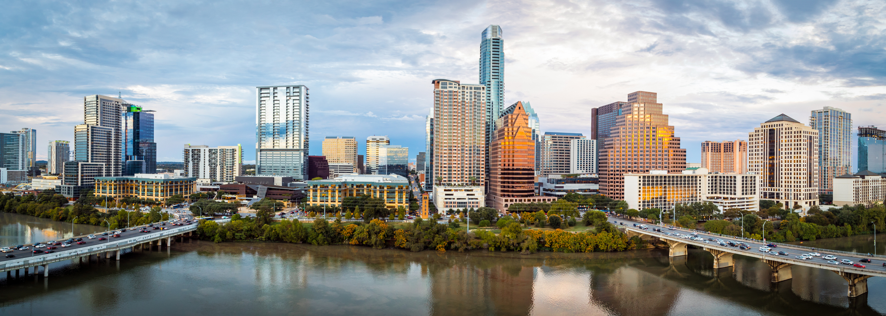
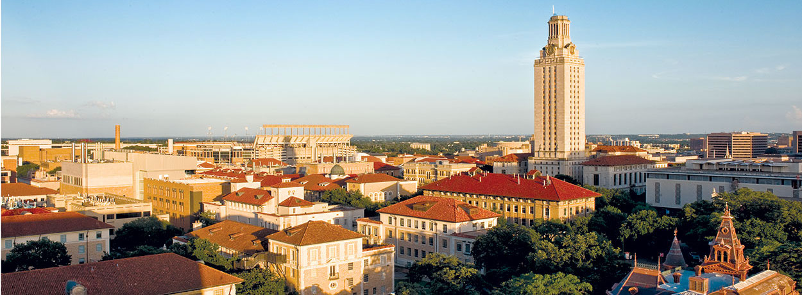
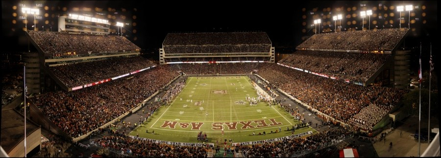
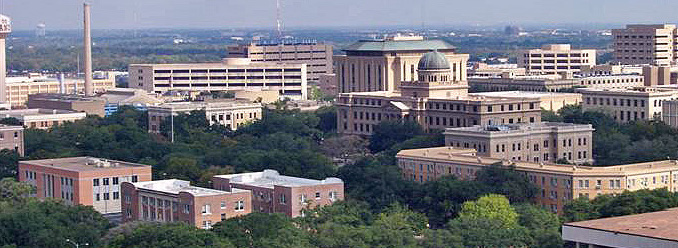
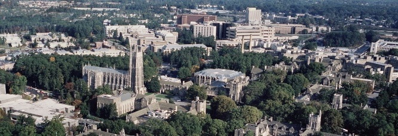
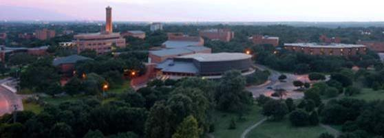
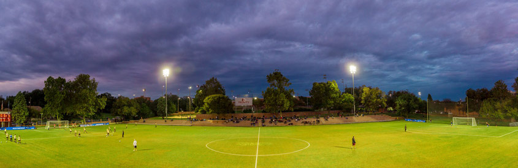
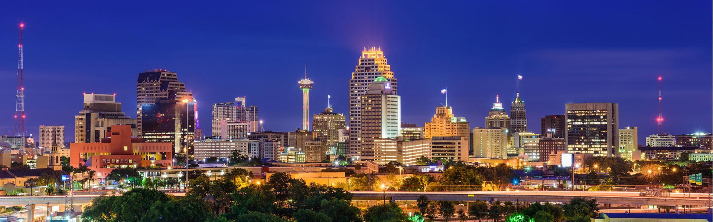

# About

## [NYC](https://github.com/pointOfive/Examples/tree/master/Experience#experience)

Last year I embarked on an exciting adventure and career opportunity by moving to NYC.
The energy and diversity (read, people) in this city have been amazing,
and my experience here has confirmed for me that I find the sense of pacing and vibrancy 
in cities incredibly motivating and enriching. 
On the other hand, there's a great sense of peace and accomplishment to be found
in nature, and as such I've really enjoyed living close to [Central Park](https://www.google.com/maps/place/Central+Park/@40.7438632,-74.0175455,12z/data=!4m5!3m4!1s0x89c2589a018531e3:0xb9df1f7387a94119!8m2!3d40.7828647!4d-73.9653551) on a quiet(er)
[Upper West Side](https://www.google.com/maps/@40.7851626,-73.9739507,14z) street (near
[Zabar's](https://www.google.com/maps/place/Zabar's/@40.7848188,-73.984094,16z/data=!4m5!3m4!1s0x89c258862e7ae59b:0x161b26b78af02870!8m2!3d40.7848148!4d-73.9797113),
the [AMNH](https://www.google.com/maps/place/American+Museum+of+Natural+History/@40.7802558,-73.9829629,15z/data=!4m5!3m4!1s0x89c258f4b00f7a09:0xa27d8172624c5db1!8m2!3d40.7813241!4d-73.9739882), and
[Riverside Park](https://www.google.com/maps/@40.8027274,-73.9705007,14z)).
Aside from Central Park (which is obviously the best thing a city ever did for itself), I am
unendingly impressed with the efficiency of the [Subway System](http://web.mta.info/maps/submap.html) in [Manhattan](https://en.wikipedia.org/wiki/Boroughs_of_New_York_City),
which clearly distinguishes me as a non-native... but I suppose that's exactly why I have loved having the chance to live in, explore, and enjoy this unique city. 

## [ATX](https://github.com/pointOfive/Examples/tree/master/Experience#experience)

The opportunity to come to NYC materialized because I had spent the previous year or so
expanding from my [Bioinformatics](https://github.com/pointOfive/Examples/tree/master/Compute#hpc) skill set
into the world of [Data Science](https://github.com/pointOfive/Examples/tree/master/Lectures#lecture-material). 
Despite having a [PhD in Statistics](https://stat.duke.edu/people/scott-l-schwartz) and working in
[data analysis](https://github.com/pointOfive/Examples/tree/master/Papers#publications),
I had never explored much of the modern data analysis toolset
(e.g.,
[Python, SQL, Machine Learning, Classification, Big Data, Recommender Systems, Dimensionality Reduction, NLP](https://github.com/pointOfive/Examples/tree/master/Lectures#lecture-material),
etc.).  But picking up these tools never felt "hard" or "foreign" -- predictive methodology and supporting tools therein
are a very comfortable, seamless and natural extension of my educational and professional background.
Actually, coming back to [scripting and coding](https://github.com/pointOfive/Examples/tree/master/Code),
[organizing data processing environments](https://github.com/pointOfive/Examples/tree/master/Compute#aws-ec2emrs3) and
[modeling and analyzing data](https://github.com/pointOfive/Examples/tree/master/Examples) just feels like returning to my roots -- it's comfortable, exciting, and
nice to be home. 

## [UT](https://github.com/pointOfive/Examples/tree/master/Experience#experience)

Living in Austin was good -- 
nice neighborhoods, good [running](http://www.mountainbiketx.com/downloads/texas/maps/Shoal_Creek.pdf), and 
year round 68-degree natural spring [pools](https://www.google.com/maps/place/Deep+Eddy+Municipal+Pool/@30.2742588,-97.7777817,15z/data=!4m5!3m4!1s0x8644b546480d4c9f:0x36e8599164fc2421!8m2!3d30.276515!4d-97.7732058).  
I moved to Austin to join the [Switchgrass Biofuel Crop Program](https://sites.cns.utexas.edu/juenger_lab/home)
at the [University of Texas](https://integrativebio.utexas.edu)
so I could be a part of, and contribute to a long term research program.
At UT I was a part of an incredibly strong team of postdocs and graduate students with very diverse backgrounds ranging from 
molecular biology, ecology, botany, plant physiology, and field managers to myself (who provided
[Bioinformatic](https://github.com/pointOfive/Examples/tree/master/Compute#open-source-tools) and
[Statistical](https://github.com/pointOfive/Examples/tree/master/Papers#publications) support to the lab).
The combined expertise in the lab comprised a molecular marker based crop development program
with tens of field sites ranging from Mexico to Illinois
targeting understanding of plant ecotype/environment (GxE) interactions
and crop adaption genetics via panel and mapping population experiments. 
And when planting and sample collection season came around I got go outside
and pretend to be a farmer, which was a perk of the position that I always enjoyed. 

## [TAMU](https://github.com/pointOfive/Examples/tree/master/Experience#experience)

Prior to moving to Austin I spent several very enjoyable years in
[College Station, Texas](https://www.google.com/maps/place/College+Station,+TX/@30.5907759,-100.7740924,6z/data=!4m5!3m4!1s0x8646848619463ca3:0xc969c74db6bf6ac9!8m2!3d30.627977!4d-96.3344068), home of the
[Aggies](https://medium.com/@ln_ib/reload-collected-texas-a-m-aggie-jokes-4f74c2d86f34) of
[Texas A&M University](https://borlaug.tamu.edu).  If you're from Texas you know what Texas A&M is, but it was only
about the time of my arrival that the rest of the country also found out (and that probably had something to do with
[Johnny Football](https://www.youtube.com/watch?v=7kVxxdFOcQQ), as opposed to my arrival alone).
While at TAMU I worked for the [AgriLife Bioinformatics Services Core](http://www.txgen.tamu.edu)
driving and supporting the adoption of next generation genomic sequencing technology ("nextgen sequencing")
across the academic and industry research community associated with Texas A&M.
This involved providing consultation, contracting, and educational services
regarding Illumina nextgen sequencing platforms and subsequent downstream data processing and analysis, 
all of which I learned on the job. 
While at A&M I interfaced with a very diverse set of research and application areas,
but I consistently interacted with the agricultural community.
This was a very pleasant and positive experience in which I saw a side 
of Texas that was new to me, and eventually lead to my 
my interest in moving to Austin to join the crop development program at UT.

## [Postdoc](https://github.com/pointOfive/Examples/tree/master/Experience#experience)

The reason I ended up working in genetic sequencing technologies in the first place was because
I found genetic data extremely compelling.
I have always been very "applied" in my orientation and preferred to work on "real world" problems
-- for example, it was the power of small sample sizes in polling that first drew me to data analysis.
But what could be more exciting and promising than working on the data that programs life?
So, without even a single college biology class to my name I joined the 
[Training Program in Biostatistics, Bioinformatics, Nutrition and Cancer](https://www.stat.tamu.edu/train/index.html)
at Texas A&M University.  While there I was embedded in a cancer nutrition wet lab helping
biology postdocs and graduate students analyze their data while learning about the
biology, genetics, and experimental tools that produced it.
From simple ANOVA experimental design, I moved onto "large p small n" settings (i.e., transcriptomics),
and then metagenomics which provided my introduction and eventual transition to nextgen sequencing.
The basis and foundation of my ability to work in and contribute to
[scientific research](https://github.com/pointOfive/Examples/tree/master/Papers#publications)
was formed though this outstanding postdoctoral experience.

## [Duke](https://github.com/pointOfive/Examples/tree/master/Experience#experience) 

Graduate School was an amazing opportunity for me.
Through my steady commitment in college I managed to make a path into
one of the most prestigious statistical departments in the country at [Duke University](http://gardens.duke.edu)
were I completed a [PhD in Statistics](https://github.com/pointOfive/Examples/tree/master/Papers#publications).
The best thing about this -- and something I will always remain appreciative of -- was that it gave me the opportunity 
to meet and work with the best students that the world had to offer. 
[Duke's program](https://stat.duke.edu) focussed on Bayesian Analysis, which made for a distinctly different educational experience
than a "Classical Statistics" program. Bayesian Inference provides the capability to model complex
data generation mechanisms, and so the focus of the program was customized hierarchical modeling
of uncertainty as opposed to a general survey of statistical methods and techniques. 
Bayesian Inference relies on sampling from posterior distributions which has historically been
somewhat of a barrier to its general adoption, but recent developments in
[probabilistic programming tools](http://pymcmc.readthedocs.io/en/latest/tutorial.html)
and [general posterior sampling algorithms](http://www.stat.columbia.edu/~gelman/research/published/nuts.pdf)
have greatly democratize Bayesian Analysis and facilitated its accessibility use outside of specialized academic communities. 

## [Trinity](https://en.wikipedia.org/wiki/NCAA_Division_III_Men%27s_Soccer_Championship)

The reason I was able to get into such a prestigious graduate program 
was a because I developed a skill set that was a very good match to the program.
I graduated *Summa Cum Laude* from [Trinity University](http://www.trinitytigers.com/sports/msoc/index)
with a BS in [Computer Science](https://new.trinity.edu/academics/departments/computer-science)
(receiving Class of 2005 Outstanding Computer Science Student honors)
and a BA in [Mathematics](https://new.trinity.edu/academics/departments/mathematics)
(having been twice selected to represent the mathematics department at an annual undergraduate mathematics conference
hosted by the Technical University of Munich in Germany).
This combination was the perfect intersection of skills for a computationally (i.e., Bayesian) oriented statistics program.
I think it also helped that I had been incredibly fortunate to have had my hard work at Trinity 
recognized by two NSF CSEMS scholarships and a Barry M. Goldwater scholarship.
In addition to my academic pursuits in College, I was also a member of Trinity's Mens Soccer program,
winning a [National Championship](http://www.trinitytigers.com/history/nationalchampions/index) in 2003 and 
receiving NCAA Academic All-American honors in 2005.

## [San Antonio](https://www.washingtonpost.com/news/fancy-stats/wp/2014/06/16/with-five-nba-titles-in-15-years-the-spurs-are-a-dynasty/)

Attending Trinity was actually a bit of a fairy tale story in and of itself.
Having grown up playing soccer in San Antonio I had visited Trinity's gorgeous campus
and amazing soccer facilities on a number of occasions, but never imagined that I would be
able to attend a school like Trinity. My plan for college was to complete two years at
the local community college, 
San Antonio Community College (SACC), and then transfer to the University of Texas at
San Antonio (UTSA). I left high school early and spent what would have been my
high school senior year at SACC. While at SACC I played on the soccer team and it turned out that the coach at 
SACC knew the coach at Trinity and recommended me to him.  And after a short conversation about
my SAT scores and grades at SACC I ended up at Trinity rather than UTSA living an amazing fantasy life dream I
had never actually had.  I had put a lot of effort into soccer growing up and it ended up paying off
in a completely unexpected way... life seems to be weird like that. 

## [Growing Up](https://github.com/pointOfive/Examples)

In addition to pursing an active and healthy lifestyle, 
learning was always a very important focus of the family.
Because of this I grew up viewing learning as a privilege to be taken seriously and treated with the utmost diligence.
I think this is why I viewed Trinity as such an amazing opportunity (as it indeed proved to be),
why the opportunity to attend Trinity materialized in the first place, 
and why I was ready and able to excel and thrive in a student-athlete role.
Actually, because of my families views on learning I had been homeschooled until 8th grade, which
has proven to be the singly most advantageous event in my life. 
It also meant that I grew up in a household with a very wide, open and accepting worldview. 
My parents had been missionaries in Mexico City and Costa Rica before I was born
(and my mother herself grew up as a missionary kid overseas in Beirut, Lebanon and Kuala Lumpur, Malaysia)
but this never led to dogmatic or black and white thinking; rather, all aspects of the world and
all walks of life were to be valued and respected.  It has been a privilege to
carry this outlook with me as I've progressed through life. 

