# Utilize Venn diagrms to represent events and visualize their probabilities 

## Set Up

### Terminology 

Suppose we are observing a particular phenomenon at a given point in time. For example, 

- which card is drawn from a standard deck of 52 cards,
- whether or not you get a text within the next 15 minutes, or 
- the next point in some predetermined grid for which lightening will strike.

Observing and recording result of a random phenomenon such as these above is known in statistical terminology as performing an _experiment_.
It is common to refer to the experiment using (an uppercase) \\(X\\). 
Building on this convention, an actualized result, or _outcome_, of experiment \\(X\\) is referred to using (a lowercase) \\(x\\).
And the set of all possible outcomes that might be observed in experiment \\(X\\) is called the _sample space_ \\(S_X\\) of the experiment.
Thus, \\(S_X\\) includes any outcome \\(x\\) that might be produced by experiment \\(X\\). 
To make this concept conrete,
let's suppose we can represent the collection of all the possible outcomes \\(S_X\\) of experiment \\(X\\) as a 2D "box":

<table style="width:100%;">
  <tr>
    <td style="text-align: center;">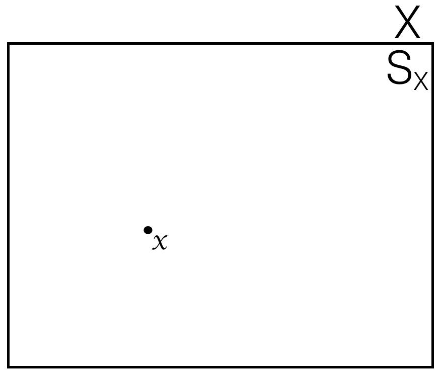</td>
  </tr>
</table>


### Uniform randomness

Now suppose for the moment that any outcome \\(x\\) that could actualize from experiment \\(X\\) is just as likely as any other,
so that every outcome \\(x\\) is equally likely.  In our above 2D "box" representation, this means that each "point" in the box 
(i.e., each outcome \\(x\\) in \\(S_X\\)) has the same chance of happening.  You could imagine this as throwing darts at the 2D "box" 
in a completely random manner such that hitting any given point \\(x\\) is as likely as hitting any other. 
This type of random behavior is known a _uniform_ randomness,
and given this uniform randomness we can start to make probability statements about certain sets of outcomes.  For example, 
in the figure below the set of oucomes \\(E\\) collected together within the boundaries of a circle
make up \\(33\%\\) of the overall are of the 2D "box" \\(S_X\\). Thus, the chance that an outcome \\(x\\) that we observe from the experiment being 
among the outcomes included within circle \\(E\\) is \\(33\%\\).
A set of outcomes such as \\(E\\) is known as an _event_, and
we specifiy the probability of event \\(E\\) occuring (i.e., an observed outcome \\(x\\) of an experiment \\(X\\) being a member of event \\(E\\))
as \\(Pr(E)\\).  For example, in the figure below we would say \\(Pr(E) = 0.33\\). 
Note that when we start doing probability work, we actualy work with _probabilities_ (real valued numbers between 0 and 1, inlusive)
rather than _percentages_ (real valued numbers between 0 and 100, inlusive, and formatted with a postfixed "%" chararacter). 
The best practice is to follow this convention.  
A common mistake that is often made is to call a "probability", like 0.33, a "percentage"
when in actual fact the percentage 0.33% is very different than the percentage 33%. 

<table style="width:100%;">
  <tr>
    <td style="text-align: center;">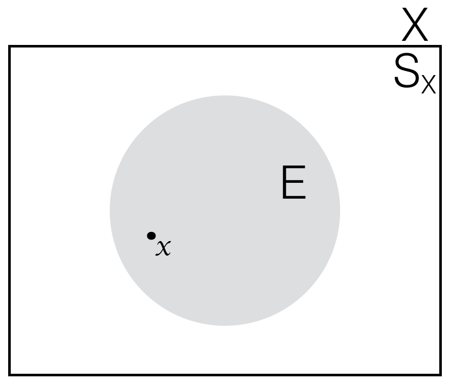</td>
  </tr>
</table>


<div class='bg-info' style='padding:8px;border-style:solid;border-width:2px;border-color:#00BFFF'>
<strong>Aside:</strong><br>
Unifrom randomness isn't the only kind of randomness we might have in our current 2D "box" example, of course.
For example, you might imagine a sort of topographical map over the 2D "box" that specifies the outcomes in certain areas of the box
as being more likley than outcomes in other areas of the box.  
Indeed, the study of probability is in large part devoted to exploring and understanding these types of "more interesting" 
probability distributions, and we will certainly come back to explore such considerations further. 
Nonetheless, for the purposes of focusing ourselves on specific ideas germane to building up the necesarry foundations 
to address those topics without getting ourselves immediately bogged down in tangential complications, 
we'll assume for now that we have uniform randomness over all the outcomes in the sample space of the experiement.
</div>


### !challenge

* type: multiple-choice
* id: scott_prob_1s
* title: Probabilities over a uniform space

### !question
Question 1

Assuming uniform randomness over the outcomes \\(x\\) in the sample space \\(S_X\\) of an experiment \\(X\\) represented by the following figures,
which of the "gray area" events has a 20% chance of happening opon observing the actual outcome of the experiment?


<table style="width:100%;">
  <tr>
    <td style="text-align: center;">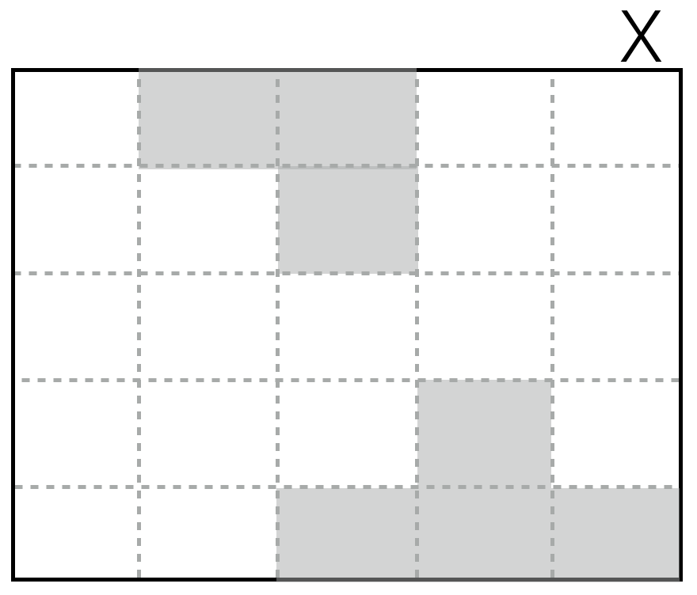</td>
    <td style="text-align: center;">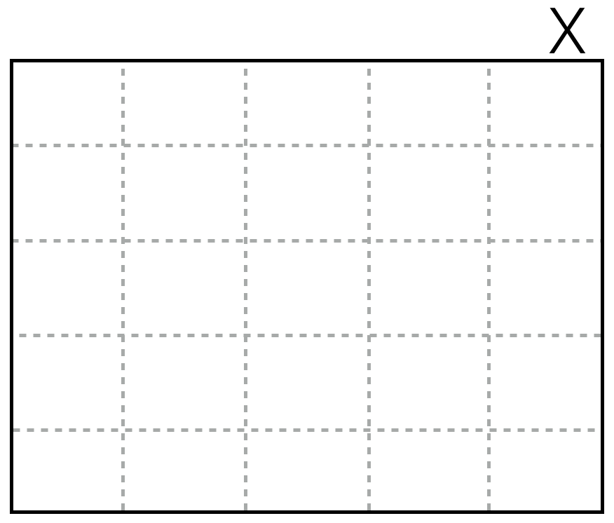</td>
    <td style="text-align: center;">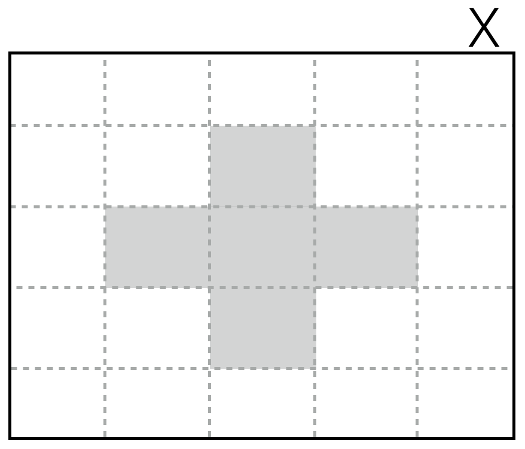</td>
  </tr>
  <tr>
    <td style="text-align: center;">(a) disjoint event</td>
    <td style="text-align: center;">(b) null event</td>
    <td style="text-align: center;">(c) plus event</td>
  </tr>
</table>
<table style="width:100%;">
  <tr>
    <td style="text-align: center;">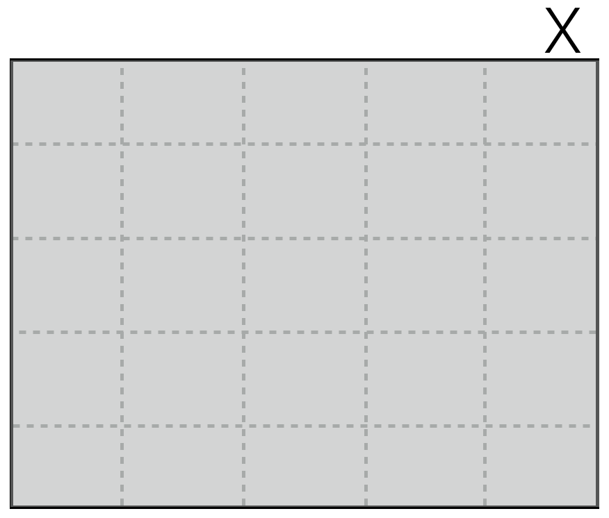</td>
    <td style="text-align: center;">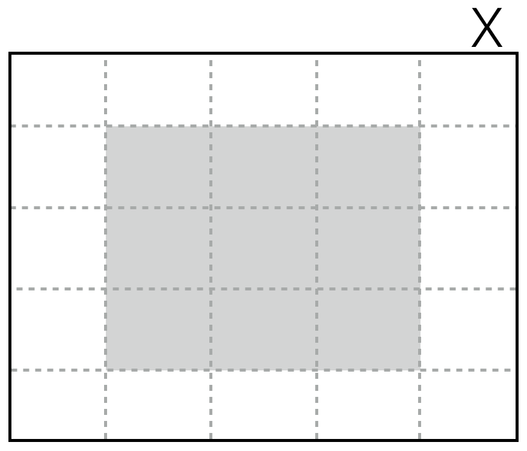</td>
  </tr>
  <tr>
    <td style="text-align: center;">(d) sample space event</td>
    <td style="text-align: center;">(e) box event</td>
  </tr>
</table>

### !end-question
### !options

* (a) disjoint event
* (b) null event
* (c) plus event
* (d) sample space event
* (e) box event

### !end-options
### !answer
(c) plus event
### !end-answer
### !explanation

Since there are 25 total squares representing 25 possible events 
in the sample space, and each square is the same size (and we're assuming uniform randomness over the outcomes),
the event in figure (c) has a 20% chance of happening since it is comprised of 5 squares.  
I.e., 5 squares of 4% make up 20%.

**Fun Fact:** the collection of events that do not overlap but together comprise the whole of an event 
are referred to as a _partition_ of the event. 

**Fun Fact:** the non-overlapping, or _disjoint_ nature of any two event members of a partition is referred to as _mutual exclusivity_,
which means that a single outcome \\(x\\) can only actualize at most one of the two events. I.e., only one or the other (at most) 
of two _mutually exclusive_ events can have occured once a single outcome \\(x\\) is observed. This is of course because if 
two events are "non-overlapping" then a single \\(x\\) cannot be in both!

**Fun Fact:** the fact that we can add together the separate probabilities of "the parts" to make the probability of "the whole" is a seemingly simple,
but actually very powerful idea, called _the law of total probability_. We will return to the law of total probability many times so
keep it in mind. 

### !end-explanation
### !end-challenge


### !challenge

* type: multiple-choice
* id: scott_prob_2s
* title: Probabilities over a uniform space

### !question
Question 2

What is the probability of the event \\(E_1\\) which includes the entire sample space \\(S_X\\) of experiment \\(X\\)?
And what is the probability of the event \\(E_2\\) which includes nothing (i.e., \\(\emptyset\\))? 


### !end-question
### !options

* (a) \\(Pr(S_X) = 1, and Pr(\emptyset) = 0\\)
* (b) \\(Pr(E_1) = 0, and Pr(E_1) = 1\\)
* (c) \\(Pr(E_1) = 1, and Pr(E_2) = 0\\)
* (d) We don't have enough information to know

### !end-options
### !answer
(c) \\(Pr(E_1) = 1, and Pr(E_2) = 0\\)
### !end-answer
### !explanation

Answer (a) is a correct statement since every outcome \\(x\\) is in \\(S_X\\) and no outcome \\(x\\) is in \\(\emptyset\\).
Thus, when \\(x\\) is realized from experiment \\(X\\) the event \\(S\\) will have happened and the event \\(\emptyset\\).
Thus, there is a 100% chance that event \\(S\\) will occur and a 0% chance that event \\(\emptyset\\) will occur; or,
eqivalently stated, \\(Pr(S_X) = 1, and Pr(\emptyset) = 0\\).

**Fun Fact:** \\(Pr(S_X) = 1, and Pr(\emptyset) = 0\\) are basic axioms of probability theory -- all experiments that 
behave probabilistically must satisfy these properties. 

The correct answer of course is (c), however, since the problem asked you to specifiy probabilities of events \\(E_1\\) and \\(E_2\\) occuring.

### !end-explanation
### !end-challenge


## Set Arithmatic

### Basics

Using _set operator notation_ we can construct new events on the basis of events we already have.  
The standard set operators are 

- _Complement_: \\(E_1^C\\)

- _Union_: \\(E_1 \cup E_2\\)

- _Intersection_: \\(E_1 \cap E_2\\)

and their corresponding operations are demonstrated in the following figures, 
known as [_Venn diagrams_](http://www.combinatorics.org/files/Surveys/ds5/VennSymmEJC.html):

<table style="width:100%;">
  <tr>
    <td style="text-align: center;">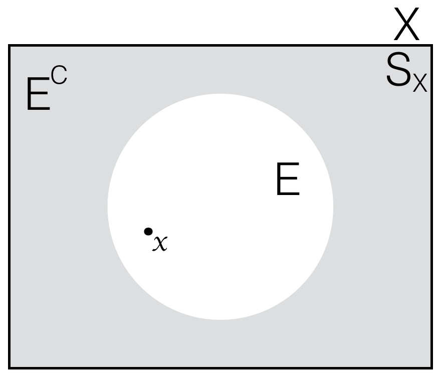</td>
    <td style="text-align: center;">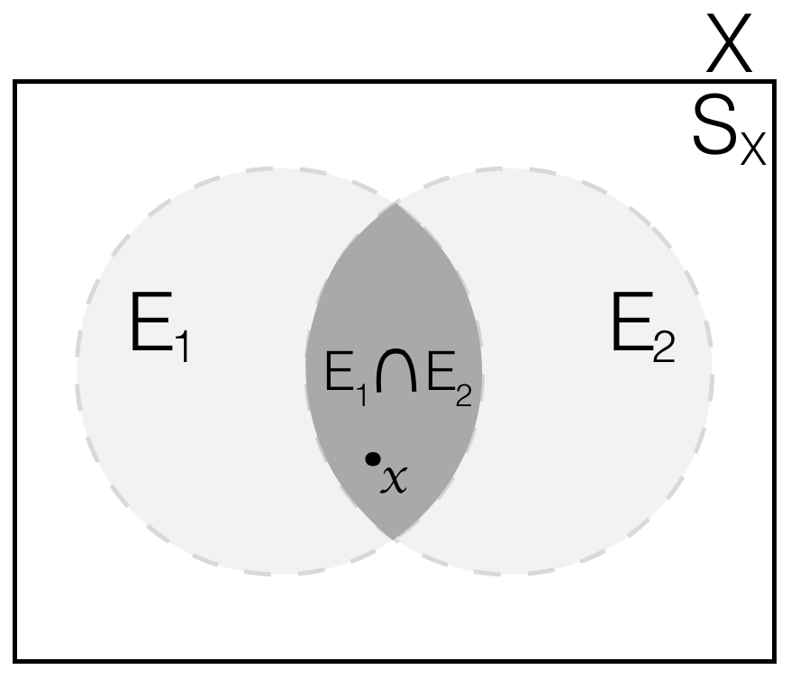</td>
    <td style="text-align: center;">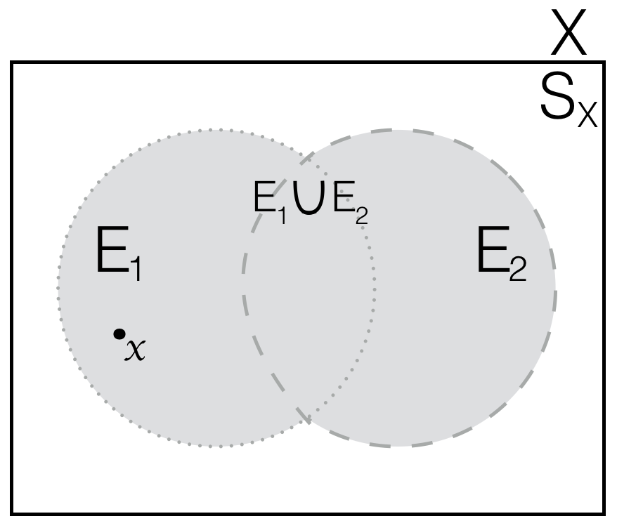</td>
  </tr>
  <tr>
    <td style="text-align: center;">Complement</td>
    <td style="text-align: center;">Union</td>
    <td style="text-align: center;">Intersection</td>
  </tr>
</table>


### De Morgan's laws

Naturally, such operations can be combined together in increasingly complex ways, as desired.  For example, 
\\( (E_1 \cup E_2)^C \\) or \\(E_1^C \cap E_2^C \\), or \\( (E_1 \cap E_2)^C \\) or \\( E_1^C \cup E_2^C \\).  
Now interestingly, it turns out that those previous expressions were actually redundant, 
as the following tautologies -- known as _De Morgan's laws_ -- indicate: 

(a) \\( (E_1 \cup E_2)^C = E_1^C \cap E_2^C \\)

and 

(b) \\( (E_1 \cap E_2)^C = E_1^C \cup E_2^C \\)

While De Morgan's laws look truly complex, they're actually pretty easy little 
rules that just demonstrate the flexibility of expression available using set notation.  
De Morgan's laws can be explained graphically using the following Venn diagrams:

<table style="width:100%;">
  <tr>
    <td style="text-align: center;"></td>
    <td style="text-align: center;">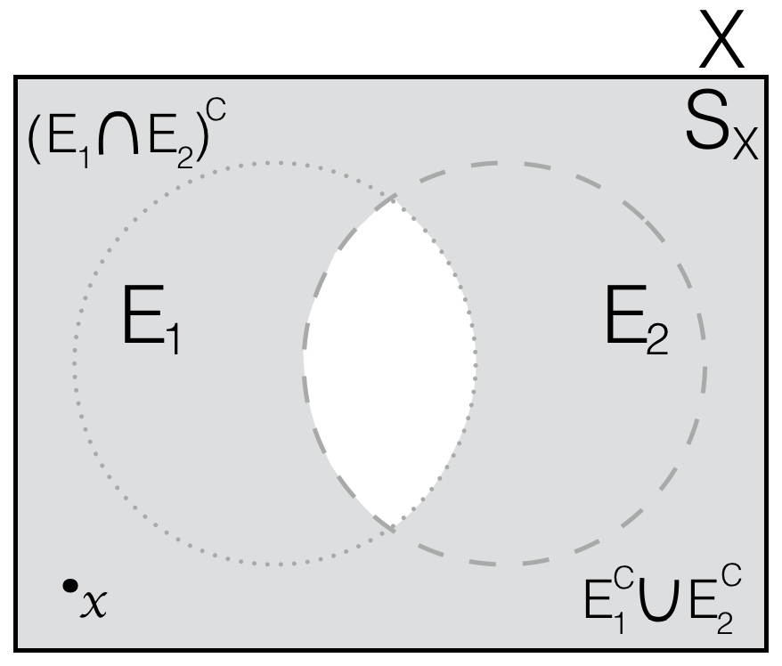</td>
  </tr>
  <tr>
    <td style="text-align: center;">Complement of the Union</td>
    <td style="text-align: center;">Complement of the Intersection</td>
  </tr>
</table>


<div class='bg-info' style='padding:8px;border-style:solid;border-width:2px;border-color:#00BFFF'>
<strong>Aside:</strong><br>
It is a general rule in mathematics that the notation needed to precisely state mathematical notions 
can be extremely dense and challenging. Even if the meaning and idea is not that difficult, for example 
as is the case with De Morgan's laws.   One might at least then hope that once careful and precise
notation has expressed a meaning, the result will at least look astethically pleasing! But even this may not always be the case.
The truth is that mathematical notation is a form of expression -- a language -- that is learned the way every other
language is learned: through practice, practice, and more practice.  It's all about being familiar with the 
meaning and usage of notation.  Notation is not something that mathematical geniuses understand by mere viture of 
the application of their.  Rather, mathematical geniuses learn to express their clever and insightful (and often very simple) 
ideas using the rich and precise language of expression that mathematical notation provides.  So don't freak out when you
see some new mathematical notation!  Just set about understanding what it means and how it's used!
</div>


### !challenge

* type: multiple-choice
* id: scott_prob_3s
* title: Graphical interpretation of De Morgan's law

### !question
Question 3

Do you understand how the above Venn diagram demonstrates De Morgan's laws?

### !end-question
### !options

* yes
* no

### !end-options
### !answer
yes
### !end-answer
### !explanation

In the first picture (a) everything that's not "the white union of \\(A\\) or \\(B\\) (\\(A \cup B\\))" is the gray event (\\(A^C \cap B^C\\)), and
in the second picture (b) everything that's not "the white intersection of \\(A\\) and \\(B\\) (\\(A \cap B\\))" is the gray event (\\(A^C \cup B^C\\)). 

To see that "the gray" events are indeed characterized by the given set operations notice that \\(A^C\\) and \\(B^C\\) are:

<table style="width:100%;">
  <tr>
    <td style="text-align: center;">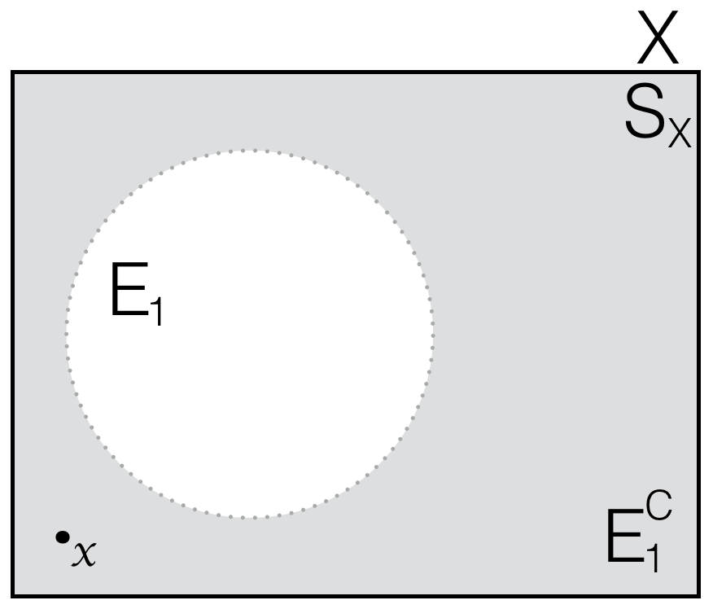</td>
    <td style="text-align: center;">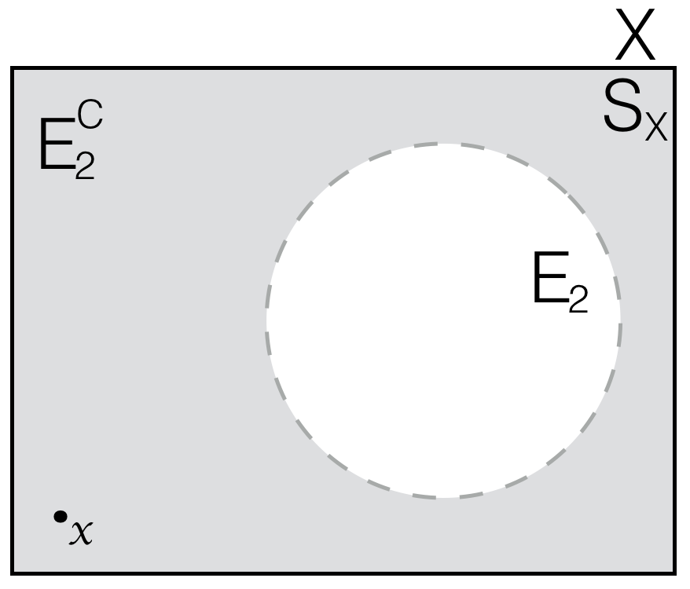</td>
  </tr>
  <tr>
    <td style="text-align: center;">Complement of the First Event</td>
    <td style="text-align: center;">Complement of the Second Event</td>
  </tr>
</table>

### !end-explanation
### !end-challenge

### Partitions and mutual exclusivity

As referenced previously in _Question 1_, 
a collection of events \\(E_1, E_2, \cdots, E_m\\) that do not overlap but together comprise the whole of a 
event \\(E\\), i.e., \\(E = \overset{m}{\underset{i=1}{\cup}}E_i\\)  are referred to as a _partition_ of event \\(E\\).
Now, as also noted in _Question 1_, the notion of non-overlapping, or _disjoint_ \\(E_i\\) and \\(E_j\\) is referred to as 
_mutual exclusivity_ and two events \\(E_i\\) and \\(E_j\\) are said to be _mutually exclusive_ \\(E_i \cap E_j = \emptyset\\),
where \\(\emptyset\\) is the event containing no outcomes. Thus, if two events \\(E_i\\) and \\(E_j\\) are mutually exclusive
then for any outcome \\(x\\), at most one of evets \\(E_i\\) and \\(E_j\\) will have occured. 


### !challenge

* type: multiple-choice
* id: scott_prob_4s
* title: Partitions

### !question
Question 4

Which collection of events comprise a partition of "gray area" event \\(E\\)?

<table style="width:100%;">
  <tr>
    <td style="text-align: center;">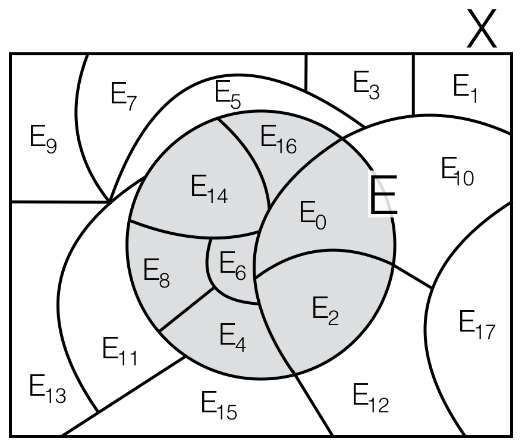</td>
  </tr>
</table>


### !end-question
### !options

* (a) All the events \\(E_i\\) where \\(i\\) is odd
* (b) All the events \\(E_i\\) where \\(i\\) is even
* (c) Events \\(E_{10}\\) and \\(E_{12}\\) plus all the events \\(E_i\\) where \\(i\\) is odd
* (d) All the events \\(E_i\\) where \\(i\\) is even exept \\(E_{10}\\) and \\(E_{12}\\)

### !end-options
### !answer
(d) All the events \\(E_i\\) where \\(i\\) is even exept \\(E_{10}\\) and \\(E_{12}\\)
### !end-answer
### !explanation

The correct answer is (d) all the events \\(E_i\\) where \\(i\\) is even exept \\(E_{10}\\) and \\(E_{12}\\). 

Answer (a) is some partition that does not combine to form event \\(E\\). 
Answer (b) includes the event \\(E\\) as a subset, rather than combining to exactly recapitulate event \\(E\\). 
Answer (c) is a partition of \\(E^C\\). 

### !end-explanation
### !end-challenge


### !challenge

* type: multiple-choice
* id: scott_prob_5s
* title: Probability of a union event

### !question
Question 5

Using the 2D "box" example from above as a guide, what is \\(Pr(E_1 \cup E_2)\\) if \\(E_1\\) and \\(E_2\\) are not mutually exclusive?

### !end-question
### !options

* (a) \\(Pr(E_1) + Pr(E_2) + Pr(E_1 \cup E_2)\\)
* (b) \\(Pr(E_1) + Pr(E_2) - Pr(E_1 \cap E_2)\\)
* (c) \\(Pr(E_1) + Pr(E_2)\\)
* (d) \\(Pr(E_1) + Pr(E_2) + Pr(E_1 \cap E_2)\\)
* (e) We don't have enough information to know

### !end-options
### !answer
(b) \\(Pr(E_1) + Pr(E_2) - Pr(E_1 \cap E_2)\\)
### !end-answer
### !explanation

Answers (a) and (b) add together too much probability.
Answer (c) is correct if \\(E_1\\) and \\(E_2\\) ARE mutually exclusive.
The correct answer adds the individual probabilities for events \\(E_1\\) and \\(E_2\\) and then 
subtracts the probability \\(Pr(E_1 \cap E_2)\\) of the intersection event \\(E_1 \cap E_2\\)
because it was double counted by \\(Pr(E_1) + Pr(E_2)\\). 

**Fun Fact:** This answer is actually true regardless of whether or not the outcomes are uniformly random or not. 

**Fun Fact:** Answer (c) shows that for mutually exclusive events \\(E_1\\) and \\(E_2\\) \\(Pr(E_1 \cap E_2) = Pr(\emptyset) = 0\\), which of course makes since
because if the experiment is run then some \\(x\\) is going to be observed.

**Fun Fact:** \\(Pr(E_1 \cup E_2 \cup E_3) = Pr(E_1) + Pr(E_2) + Pr(E_3) - Pr(E_1 \cap E_2) - Pr(E_1 \cap E_3) - Pr(E_2 \cap E_3) + - Pr(E_1 \cap E_2 \cap E_3)\\)

### !end-explanation
### !end-challenge


### !challenge

* type: multiple-choice
* id: scott_prob_6s
* title: Probability of a complement

### !question
Question 6

Using the 2D "box" example from above as a guide, what is \\(Pr(E^C)\\)?

### !end-question
### !options

* (a) \\(Pr(S_X)\\)
* (b) \\(1 - Pr(E)\\)
* (c) We don't have enough information to know

### !end-options
### !answer
(b) \\(1 - Pr(E)\\)
### !end-answer
### !explanation

This is a very commonly used "trick" in probability.  You would do well to make a special note of this rule 
and keep it in mind when you're solving probability problems.  It's more useful than you might expect from such a simple rule.

### !end-explanation
### !end-challenge


## Formal Set Notation

Venn diagrams are a very nice tool to represent events (sets of outcomes) 
and visualize event probabilities.  But there is also a more formal mathematical set notaion that 
is important to understand.  Namely, for two sets \\(A\\) and \\(B\\), we specify the following operations as follows: 

 Operation | Mathematical Notation | Meaning
----|----|----
**Union** | \\( A \cup B = \\{ x: x \in A \cup x\in B \\} \\) | The union of \\(A\\) and \\(B\\) is equal to all \\(x\\) such that \\(x\\) is in \\(A\\) or \\(x\\) is in \\(B\\)
**Intersection** | \\( A \cap B = \\{x: x \in A \cap x\in B\\}\\) | The intersection of \\(A\\) and \\(B\\) is equal to \\(x\\) such that \\(x\\) is in both \\(A\\) and \\(B\\)
**Difference** | \\( A \setminus B = \\{x: x \in A \cap x \notin B\\}\\) | The difference of \\(A\\) and \\(B\\) is equal to \\(x\\) such that \\(x\\) is in \\(A\\) but \\(x\\) is not in \\(B\\)
**Complement** | \\( A^C = \\{x: x\notin A\\} \\) | The complement of \\(A\\) is equal to \\(x\\) such that \\(x\\) is not in \\(A\\)
**null (empty) set** | \\( \emptyset \\) | The null set is empty. It contains no elements.

### !challenge

* type: multiple-choice
* id: scott_prob_7s
* title: Intersection of two sets

### !question
Question 7

\\( \textrm{Given } A=[4,9,16,25,36] \\)
\\( \textrm{ and } B=[9,21,23,25] \\ \\)
\\( \textrm{what is } A \cap B \textrm{ ?} \\)

### !end-question
### !options

* 9, 25
* 4, 9, 16, 21, 23, 25, 36
* 4, 16, 36
* none of the above

### !end-options
### !answer
9, 25
### !end-answer
### !explanation

\\(A\\) intersect \\(B\\) refers to outcomes that are in both \\(A\\) and \\(B\\). \\(9\\) and \\(25\\) are the only outcomes that are in both \\(A\\) and \\(B\\).

### !end-explanation
### !end-challenge


### !challenge

* type: multiple-choice
* id: scott_prob_8s
* title: Difference of two sets

### !question
Question 8

\\( \textrm{What is } B \setminus A \textrm{ ?} \\)


### !end-question
### !options

* 21, 23
* 4, 16, 36
* 9, 21, 23, 25
* none of the above

### !end-options
### !answer
21, 23
### !end-answer
### !explanation

\\(A\\) difference \\(B\\) refers to all outcomes that are in \\(B\\) and not in \\(A\\). \\(21\\) and \\(23\\) are in \\(B\\) but not in \\(A\\).
### !end-explanation
### !end-challenge


### !challenge

* type: multiple-choice
* id: scott_prob_9s
* title: Complement as a difference

### !question
Question 9

Define the complement of set \\(A\\) using the set difference operator.

### !end-question
### !options

* \\( A \setminus S \\)
* \\( S \setminus A \\)
* \\( S - A \\)
* none of the above

### !end-options
### !answer
\\( S \setminus A \\)
### !end-answer
### !explanation

Taking away \\(A\\) from the sample space \\(S\\) gives \\(A^C\\).

### !end-explanation
### !end-challenge


As you have seen, sets are a standard data type available in Python.
And further, Python provides set method funcitonality to accomplish
set arithmatic, as can be seen in the following code:


```python
>>> a = set(["A","B","C","D"])
>>> b = set(["C","D","E","F"])
>>> sample_space = set(["A","B","C","D","E","F","G"])
>>> a.intersection(b)
set(['C', 'D'])
>>> a.difference(b)
set(['A', 'B'])
>>> a.union(b))
set(['A', 'B', 'C', 'D', 'E', 'F'])
>>> complement_a = sample_space.difference(a)
```


### !challenge

* type: code-snippet
* language: python2.7
* id: scott_prob_10s
* title: De Morgan's laws

### !question
Question 10

Write a function that accepts two events and their sample space
(in that order), returning "Improper Specification" if three sets 
are not supplied or if the two events are not subsets of the sample 
space, and then calculates and prints all four statements associated 
with De Morgan's laws and returns `True` if the laws are satisfied 
or `False` if they fail for the two events.

### !end-question

### !placeholder

```python

def DeMorgans(A, B, S):
    '''
    Print out each of the four formulas associated with each of De Morgan's laws
    and the result of their application on the sets A and B.

    Returns True/False based on the truthfulness of De Morgan's laws for sets A and B.
    Returns "Improper Specification" if three sets are not supplied 
    or if the events A and B are not subsets of the sample space S.

    >>> DeMorgans(set([1,2,3]), set([2,3,4]), set([0,1,2,3,4,5]))
    Law 1, left side (???): [0,5]
    Law 1, right side (???): [0,5]
    Law 1, left side (???): [0,2,4,5]
    Law 1, right side (???): [0,2,4,5]
    True
    '''

    pass
```

### !end-placeholder

### !tests

```python
import main
import unittest

class TestPython1(unittest.TestCase):

    def test_DeMorgans(self):
      result = main.DeMorgans(set([1,2,3]), set([2,3,4]), set([0,1,2,3,4,5]))
      correct = True
      self.assertEqual(result, correct)

    def test_DeMorgans_2(self):
      result = main.DeMorgans(set([1,2,3]), set([2,3,4]))
      correct = "Improper Specification"
      self.assertEqual(result, correct)
```


### !end-tests


### !explanation

### !end-explanation

### !end-challenge

