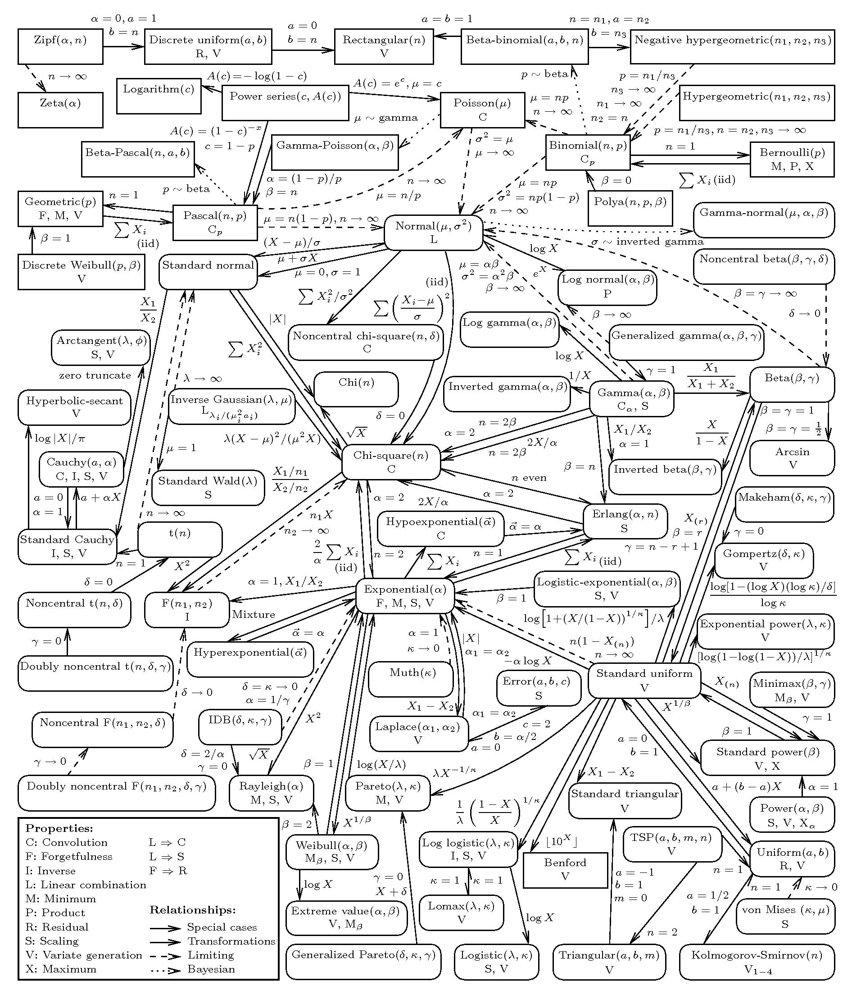
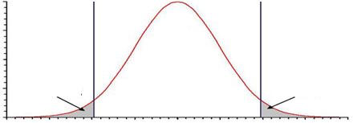

# Use probability distributions appropriately in calculations

## Non-Uniformly Random Distributions 

So far we have viewed the sample space \\(S_X\\) of outcomes \\(x\\) of an experiment \\(X\\) as
- a "2d Box" with uniformly random probabilities for all the points (outcomes) in its space, and
- a set of items (like all possible poker hands) with uniformly equal probabilities of occuring.

Because of the nature of our "uniformly random" assumptions here we could very intuitively 
calculate probabilities of events \\(E\\) as
- the proportion of the area of event \\(E\\) relative to the area of \\(S_X\\), and
- the cardinality of the event \\(E\\) relative to the cardinality of the sample space \\(S_X\\).

But outcomes \\(x\\) of an experiment \\(X\\) of course need not be uniformly random across the sample space \\(S_X\\).
That would probably make for a pretty boring world in which horse races we no more exciting than flipping a penny, 
basketball was just a stochastic process of Brownian motion, and dating didn't require any effort! 
Well, you know, pluses and minuses. But anyway, our world is not only uniformly random.
Not all random outcomes are created equal!


## The "Coin Flipping" Distributions

For example, does a coin have to be 50/50? Of course not -- not every coin is a fair coin. 
The simplest example of a model which admits unequal outcome probabilities is indeed 
the "coin flipping model", which is known as the _Bernoulli distribution_.
An experiment \\(X\\) using a Bernoulli distribution is called a _Bernoulli trial_
and the outcome \\(x\\) of a Bernoulli trial can be one of two values, traditionally called a _success_ and a _failure_.
Now, these two outcomes ("success" and "failure") can indeed be equally likely, i.e., 
\\(Pr(\text{"success"}) = Pr(\text{"failure"}) = 0.5\\), but this is not required. 
For example, for a visitor to a website with some intended business objective, we might specify that 

- \\(Pr(\text{"convert"}) = 0.02\\)
- \\(Pr(\text{"not convert"}) = 0.98\\)

where we see that \\(Pr(\text{"not convert"}) = 1 - Pr(\text{"convert"})\\)
which utilizes our familiar property that \\(Pr(E^C) = 1-Pr(E)\\) and of course must be the case 
since we intuitively know that the probability of all our possible outcomes (here the two "convert" and "not convert")
should sum to one. 


<div class='bg-info' style='padding:8px;border-style:solid;border-width:2px;border-color:#00BFFF'>
<strong>Aside:</strong><br>
The Bernoulli distribution is named after the famous mathematician who first extensively explored and pioneered its use. 
But there were actually multiple famous Bernoulli mathematicians -- all related -- and it's sometimes unclear
which Bernoulli should actually be given credit for various discoveries because it seems that at times one Bernoulli
may have stolen another Bernoulli's ideas without crediting them. 
</div>


Now what if we wanted to know how many Bernoulli trials we expect to perform before our first success? 
Well, the chance of getting a success on the first trial is of course \\(Pr(\text{"success"})\\). 
And for two trials (where we get a success on the second trial), it would be

$$ Pr(\text{"failure"}) \times Pr(\text{"success"}) $$

and in general you can see that for failures until a success on the \\(k^{th}\\) trial,
the probability would be 

$$ Pr(\text{"failure"})^{k-1} \times Pr(\text{"success"}) $$

Now, it turns out that this formula itself can be considered to be a distribution!
And this distribuiton is called the _geometric distribution_. 
But what are the key features of this distribution?  Well,

1) the probability of success \\(p\\) stays the same on each Bernoulli trial, and
2) the result of one trial doesn't effect the result of another.

At this stage these may seem to mean the same thing, but from a statistical perspective 
they are actually in fact two subtly different statements that together comprise the 
notion of "independently and identically distributed" (or "i.i.d.") which we first came across in the 
previous seciton.  So a geometric distribution gives the probabilities 
of getting the first success on the \\(k^{th}\\) trial in a series of i.i.d. Bernoulli trials.
So, the probability of getting four failures followed by a single success (i.e., a success until the \\(5^{th}\\) try) 
of a sequence of i.i.d. Bernoulli trials is

$$ Pr(\text{"failure"})^{4} \times Pr(\text{"success"}) $$

And we use the geometric distribution to calculate this probability, i.e., 
the probability of seeing the first success on the \\(k\\) try of a sequence of i.i.d. Bernoulli trials.
And of course the different outcomes \\(k\\) from a geometric distribution do not have equal probabilities.
I.e., they are not uniformly random. 

<div class='bg-info' style='padding:8px;border-style:solid;border-width:2px;border-color:#00BFFF'>
<strong>Aside:</strong><br>
The geometric distribution gets its name from a very famous mathematical series 
-- an infinite sequence of numbers that are summed up together, i.e., an infinite summation --
that is called the geometric series. Series are studied for their so-called convergence 
properties, which assess whether or not the sum tends towards a finite value.  
The sum of the probabilities defined by the geometric distribution is a special case of 
the geometric series which converges to one.  But of course we knew that it must since 
it specifies probabilities for all the possible outcomes of the sample space of an experiment. 
</div>


But how abot yet another question: what is the probability of having exactly \\(1\\) success in \\(5\\) i.i.d Bernoulli trials? 

Well, the success could happen in the first trial, or the second, or the third, fourth or fifth. 
And the probability of each of those cases is the same as \\(k=5\\) for the geometric distribution...
so if the probabilitity of each success was \\(p\\) then 
the probability of having exactly one success in 5 trials, where it doesn't matter when the success happens, is 

$$ 5 \times  (1-p)^4 \times  p $$

But how about yet another question, slightly different from even the last one: what is the probability of having exactly \\(2\\) successes in \\(5\\) 
i.i.d. Bernoulli trials? 

To solve this we would need to know 

(1) the probability of a specific instance of 2 successes in 5 trials, and

(2) the number of ways 2 successes could be distributed across 5 trials.

Well, for (1), if the probabilitity of each success was \\(p\\), then the probability of, e.g., S-S-F-F-F would be \\( p^2(1-p)^3 \\).
And this would be the same probability for any other ordering of 2 successes and 3 failures as well. 
And, for (2), the number of ways to get 2 successes and 3 failures is 5C2 since you're choosing two slots out of 5; or equivalently, 
you could also do 5C3 and get the same result. So putting all that together, if the probabilitity of each success was \\(p\\),
then the probability of \\(2\\) successes in \\(5\\) Bernoulli trials is

$$ {5\choose 3} p^2(1-p)^3 $$

Or, to generalize, if the probability of success is \\(p\\), then the 
probability of \\(k\\) successes in \\(n\\) i.i.d. Bernoulli trials is

$$ {n \choose k} p^k (1-p)^{n-k} $$

And it turns out that this expression, too, is a distribution.
And this distribution is called the _binomial distribution_. 
So we use the binomial distribution to calculate the probability of 
 this is the probability distribution we use to calcualte the probability of
\\(k\\) successes out of \\(n\\) i.i.d. Bernoulli trials. 

<div class='bg-info' style='padding:8px;border-style:solid;border-width:2px;border-color:#00BFFF'>
<strong>Aside:</strong><br>
The reason the binomial distribution got its name is because the nubmer of combinations nCk
is known as the binomial coefficient.  The binomial coefficient appears in a number of 
interesting mathematical contexts, the one for which it gets its name being the set of coefficients
resulting from the product of a particuar polynomial factorization.  And actually, the set of these
coefficients exhibits a very interesting pattern and structure known as Pascal's triangle. 
</div>


### !challenge

* type: number
* id: dist_1
* title: Probability of first head on 10th trial
* decimal: 4

##### !question

Suppose you have an unfair coin, with an 80 % chance of getting tails.
What is the probability that the first head will be on the 10th trial?

##### !end-question

##### !placeholder

Enter your answer as a decimal rounded to four decimal places

##### !end-placeholder

##### !answer
0.0268
##### !end-answer

##### !explanation

##### !end-explanation

### !end-challenge

### !challenge

* type: code-snippet
* language: python2.7
* id: dist_2
* title: Geometric coin flip simulation

### !question

Implement a function that returns a dictionary showing the probability of first seeing a head on the kth flip, for k in range 1 to 15,
for a geometric distribution for any success probability \\(p\\).

### !end-question

### !placeholder

```python
import numpy as np
from scipy.stats import geom

def probability_coin(p=0.8):
  '''
  INPUT:
  p: probability of tails on a single flip of the coin (default 0.8)

  returns
  -------
  a dictionary showing the probability of first seeing a head on the kth flip,
  for k in range 1 to 15,
  knowing that you have an unfair coin,
  with an p chance of getting tails.
  '''
  pass
```


### !end-placeholder

### !tests

```python
import main
import unittest

class TestPython1(unittest.TestCase):

    def test_probability_coin_5(self):
      result = main.probability_coin()
      result = result[5]
      correct = 0.082
      self.assertEqual(round(result,3), correct)

    def test_probability_coin_3_p40(self):
      result = main.probability_coin(p=0.4)
      result = result[3]
      correct = 0.096
      self.assertEqual(result, correct)

```

### !end-tests
### !explanation
### !end-explanation
### !end-challenge


### !challenge

* type: multiple-choice
* id: id: dist_3
* title: Probability of raining at least 2 days

##### !question

### Question

The forecast says that in the next five days the chance of rain for each day is 25%. 
Suppose that the weather on each day does not depend on the weather on the other days.
What is the probability (rounded to 3 decimal places) that it will rain for at least two days in the next five days? 

##### !end-question

##### !options


* 0.063
* 0.682
* 0.367


##### !end-options

##### !answer

0.367

##### !end-answer

##### !explanation

We can use the binomial distribution to help us answer this question: 

$$ {5\choose 2} 0.25^2(0.75)^3 + {5\choose 3} 0.25^3(0.75)^2 + {5\choose 4} 0.25^4(0.75)^1 + {5\choose 5} 0.25^4(0.75)^0$$

##### !end-explanation

### !end-challenge

### !challenge

* type: code-snippet
* language: python2.7
* id: dist_4
* title: Rainy days simulation

### !question

Implement a function that will simulate the number of days of rain in the next five days, 
knowing the 25% forecast, and the independence of rain events across days. 
Generate a large number of experiments to obtain the proportion (a.k.a., simulated probability) 
of the experiments in which that number is at least 2.


### !end-question

### !placeholder

  ```python
  import numpy as np
  from scipy.stats import binom

  def probability_rain(simulation_size=100000):
    '''
    choose the simulation_size

    returns
    -------
    probability that it will rain for at least two days in the next five days,
    knowing that the forecast says that in the next five days the chance of rain
    for each day is 25%
    '''
    pass
  ```


### !end-placeholder

### !tests

```python
import main
import unittest

class TestPython1(unittest.TestCase):

    def test_probability_rain(self):
      result = main.probability_rain()
      correct = 0.37
      self.assertEqual(round(result,2), correct)

```

### !end-tests

### !explanation

### !end-explanation

### !end-challenge


## The Poisson Distribution

Besides the Bernoulli, Geometric, and Binomial distributions, we have also already seen another distribution: the uniform distribution -- where
every outcome \\(x\\) in experiment \\(X\\) has an equally likely probability of occuring. 
Another distribution that is quite useful as a model for random outcomes is the _Poisson distribution_.  

The Poisson distribution specifies the probability of a specific number of occurrences within a certain window of time.
The window of time is some arbitrary period of your own choosing and in and of itself is not not a part of the 
probability specification.  It is simply taken as given.  And then within that window the Poisson distribution 
specifies the probability of the number of occurances of some thing.  These "occurances" are often thought of as 
"arrivals".  E.g., "the number of occurances" could be "the number of people who visited a website"
(in an hour -- your arbitrarily specified time interval). So how does the Poisson distribution specify the probability 
of having some number of occurances in the time interval?  Well, if the number arrivals is denoted by \\(x\\),
the the probability that the outcome for experiment \\(X\\) will be \\(x\\) is 


$$ Pr(X=x) = \frac{\lambda^x e^{-\lambda}}{x!},\text{ for } x \in \{0,1,2,...\} $$

Now there's quite a lot going on in this equation, so let's break down all the important parts:

- the notation \\(Pr(X=x)\\) means "the probability that the outcome of experiemnt \\(X\\) is \\(x\\)" 
  - this is a notation we will return often and very heavily rely on, so take careful note of the meaning here
- specifying that \\(x \in \{0,1,2,...\}\\) counts only the number of complete arrivals
  -  just as no one is only partially pregnant, we cannot have partial arrivals
- the greek letter \\(\lambda\\) is known as the _parameter_ of the Poisson distribution 
  - distribution parameters determine the types of outcome that the distribution generates
  - for example, are they "large" or are they "small"?  And are they consistent or are they volitile? 
  - in the case of the Poisson distribution \\(\lambda\\) specifies the average number of arrivals we expect to see
  - E.g., if we had that \\(\lambda=10\\) then a good bet would be that we're going to see 10 arrivals in our window!
  - The probability of success \\(p\\) that we encountered previously is the parameter of the coin flipping models
  - \\(\lambda\\) plays a role that is analogous to what \\(p\\) does for the coin flipping models
- finally, \\(\frac{\lambda^x e^{-\lambda}}{x!}\\) is the actual probability specification under the Poisson distribution
  - E.g., if \\(\lambda=10\\), then the probability that we have 11 arrivals is \\(Pr(X=11) = \frac{\lambda^{11} e^{-10}}{11!}\\)

<div class='bg-info' style='padding:8px;border-style:solid;border-width:2px;border-color:#00BFFF'>
<strong>Aside:</strong><br>
A poisson is a fish.  Well, at least to a french speaking person.  Poisson of course 
was another illustrious mathematician who worked on probability distribuitons; notably, 
the one which bears his name.  For more information about "les poissons", the reader 
is referred to WDP's seminal 1989 work, "La Petite Sirène". 
</div>

### !challenge

* type: code-snippet
* language: python2.7
* id: dist_5
* title: Poisson function

### !question

Suppose that the probability that a person contracts \\(x\\) colds in a given year is specified by a Poisson distribution \\(\lambda = 5\\). 
Suppose also that a new wonder drug (based on large quantities of vitamin C) has just been marketed that reduces the Poisson parameter to 
\\(\lambda = 3\\) for 75 percent of the population; althogh for the other 25 percent of the population the drug has no appreciable effect on colds. 

If an individual tries the drug for a year and has 2 colds in that time, how likely is it that the drug is beneficial for him or her?

Implement a function that will take in the number of colds a person has in a year, 
the average number of colds a person who responds to the drug has, 
and the average number of colds the standard population has, 
and return the probability that the drug is beneficial to him or her.

Hint 1: Don't forget about probability trees and Bayes' rule!

Hint 2: What should the probabilities for each branch on the first stage be? \\(0.75\\)?

Hint 3: What should the probabilities for each branch on the second stage be? \\(Poisson(X=2 | lambda)\\)?

### !end-question

### !placeholder

   ```python

def is_drug_effective(num_colds, l_drug, l_prior):
     '''
     num_colds: number of colds the person had over the 1 year period
     l_drug: parameter of a Poisson distribution that describes probabilties for the number
     of times that a person contracts a cold in a given year if the drug is effective for them
     l_prior: parameter of a Poisson distribution that describes probabilties for the number
     of times that a person contracts a cold in a given year if the drug is not effective for them

     Do not use `scipy.stats.poisson`.  The Python standard library 
     provides all the necessary mathematical capabilities to compute 
     Poisson probabilities from scratch -- do that for now.  
     
     '''

     pass
   ```

### !end-placeholder

### !tests
```python
import main
import unittest

class TestPython1(unittest.TestCase):

    def test_is_drug_effective_1(self):
      result = main.is_drug_effective(2,3,5)
      correct = 0.889
      self.assertEqual(round(result,3), correct)

    def test_is_drug_effective_2(self):
      result = main.is_drug_effective(3,2,5)
      correct = 0.700
      self.assertEqual(round(result,3), correct)

```

### !end-tests

### !explanation

### !end-explanation

### !end-challenge


## Discrete Versus Continuous Distributions

Have you noticed how all the distributions we've considered in this section 
thus far have had outcomes that belong to the set of integers? As we mentioned
in an aside previously, sets that can be enumerated in the way that integers
can be enumerated are called _countable_.  But more importantly for our purposes,
collections of such outcomes are known as _discrete_ outcomes.  All the distributions that we considered 
previously in this section are known as _discrete distributions_ because all of their
possible outcomes are discrete outcomes.  In the case of the binomial and 
Bernoulli distributions, there's a max number that the outcome can be (\\(n\\) and \\(1\\), 
respectively).  But for the geometric and Poisson distributions the outcome can
be as big an integer as you can name!

But there is a completely different kind of distribution known as a _continuous distribution_
for which the outcomes of the distribution are cannot be listed out in the same ordinal linear way
that the outcomes of discrete distributions can be listed out; rather, they are _continuous_ numbers.
As we mentioned in the previously noted aside, it is an interesting fact of mathematics that while there 
are an infinite number of integers, there are even more real, or continuous numbers.  
Real numberes of course are any integer plus any decimal amount, no matter how precisely measured. 
For an introduction to continuous distributions let's turn first to the expoential distribution. 

## The Exponential Distribution

The _exponential distribution_ is a continuous probability distribution.
This means that the outcomes it produces are continuous numbers, i.e., integer values
plus decimal values whose precision has no restriction (e.g., 1.11111111... and so on with 1's 
forever...).
The exponential distribution is actual a model of "time to arrival", which should sound very
familar... Indeed, it is!  If we measured the amount of time that it took someone to arrive,
and then measured the amount of time it took the next person to arrive, and so on...
and if the distribution of the length of time it took each of these people to arrive was 
i.i.d for some exponential distribution, then the number of people who arrived in a certain 
time interval would have a Poisson distribution!  
Actually, this process is actually called a _Poisson process_ for just this reason.  
Wow! Small world.  Yes, indeed. 
Becuase all distributions share the very interesting mathematical property of being, well, "distributions",
it turns out that they often have very interesting relationships with each other
(just like how we defined the geometric and binomial distributions based on the Bernoulli distribution). 
Here's an example of some of the relationships between some of the probability distributions: 




Breath deeply.  And don't worry.  Nobody except (maybe 50 statisticians and) the person who made this graphic 
know what all these distributions are (and even that person probably only knew it for as long as they were making
the graphic). For now you've already learned about a handful of discrete distributions, and now you're learning
about your first continuous distribution: the exponential distribution.  So, let's return to that.  

The distribution of the exponential distribution is defined as 

$$ f(X=x) = \lambda e^{-\lambda x}, \text{ for } x \in (0, \infty) $$

but again, there are some things in this expression that require careful attention.

- First, note that we specify that the outcomes of this distribution are continuous by requiring that \\(x \in (0, \infty)\\). 
  - This is how we know this expression is talking about a continuous distribution rather than a discrete distribution. 
- Second, notice that we're using our \\(X=x\\) notation that we first introduced with the Poisson distribution.
- However, we do note use the \\(Pr\\) notation, and instead we use \\(f\\) and THIS IS NOT A TYPO!
- We don't use \\(Pr\\) because continuous distributions don't return probabilities like discrete distributions. 
  - That's super important, so we let's put it here twice.
- We don't use \\(Pr\\) because continuous distributions don't return probabilities like discrete distributions. 

So what the heck is the function \\( \lambda e^{-\lambda x}\\) for then if it doesn't return probabilities
because the exponential distribution is continuous and not discrete?  Well this function actually defines, er,
well, you know, a function.  Specifically, here are a few of the functions it defines for a few different choices 
of \\(\lambda\\) it defines the function.


Now remember, the height of these functions do not define the probabilitiy of the outcome \\(x\\) that they're associated with.
Instead -- and this is different than a probability -- they define the _relative frequequency_ of the outcomes compared to each
other.  So if the function is twice as large for some outcome \\(x_2\\) as it is for some outcome \\(x_1\\), then if we were
to keep producing random outcomes from an i.i.d. exponentially distribution, then we'd see outcomes that had numbers close to
\\(x_2\\) about twice a frequently as numbers that were close to \\(x_1\\). And of course, the weird thing about 
continuous distributions is that we'd probably never see the exact numbers \\(x_2\\) or \\(x_1\\) because think about
how many decimal places these numbers might have that we'd have to to match...


- The greek letter \\(\lambda\\) in \\( \lambda e^{-\lambda x}\\) is the parameter of the exponential distiribution. 
  - It's not the same thing as the \\(\lambda\\) in the Poisson distribution, i.e., \\(\frac{\lambda^x e^{-\lambda}}{x!}\\),
  - but just like the Poisson \\(\lambda\\) and the \\(p\\) in the coin flipping distirbutions, the exponential \\(\lambda\\) parameter determines the types of outomes the distribution generates. 
  - In the case of the exponential distribution \\(\frac{1}{\lambda}\\) specifies the average time (in unspecified units) that it will take for the next arrival to occur, i.e., the expected value of outcome \\(x\\).
  - So if \\(\lambda=5\\) it will take about 0.2 time units on average for an arrival to occur, while if \\(\lambda=0.1\\) it will take about 10.
  - You can see this effect in the above exponential distributions -- \\(\frac{1}{\lambda}\\) kind of looks like a reasonable value for the "average" outcome that might be produced by the given exponential distribution.

Now because the functions defining continuous distributions, such as \\( \lambda e^{-\lambda x}\\), 
do not define probabilities and instead define relative frequencies, what we do when we want to make probability statements about
outcomes \\(x\\) from experiments \\(X\\) that have continuous distributions is to actually make statements about areas. What!?!?
Yes, this may seem a little bit unexpected, but

- the heights (values) defined by the function do not represent probabilities but instead represent relative frequencies; however

- the area under the function for any given region of the form \\(x \in E\\) actually gives the probability that the outcome \\(x\\)
will be in \\(E\\). 

So the "area under the curve" over a region \\(E\\) of a continuous distribution tells the probability that event \\(E\\) will occur,
where event \\(E\\) is of course the statement that outcome \\(x \in E\\) when \\(x\\) is actualized from experiment \\(X\\).
But of course, if all this is true, then what must the area be under the entire curve?

### !challenge

* type: multiple-choice
* id: id: dist_6
* title: Probability under continuous distributions

##### !question

### Question

If probabilities of events are calcluated as "areas are curvers" for continuous distributions,
what must the total area under the total length of the curve be for a continuous distribution?

##### !end-question

##### !options


* 100
* 1
* \\(\infty\\)


##### !end-options

##### !answer

1

##### !end-answer

##### !explanation

Probabilities are given as numbers between 0 and 1, inclusive.  So we don't say the probability is 
100; although we may say that there's a 100% chance of something. And while there are some functions 
whose area under curve could be infinite (such as, e.g., the function \\(y=x\\), 
functions that define continuous distributions are specifically chosen so that the total area under 
their curve is 1 exactly for the purposes of allowing us to use areas under their curves as probabilities.

##### !end-explanation

### !end-challenge

Repeating the last point of the explanation:
"continuous distributions are specifically chosen so that the total area under their curve is 1 exactly 
for the purposes of allowing us to use areas under their curves as probabilities".  
So this is quite the twist!  For continuous distributions we don't actually choose functions because their value
tells us probabilities, as we did for discrete distributions.  
But we choose functions becasue their areas well us probabilities! Very highly super cool (and clever). 

Now, to calculate areas under the curve for some function such as the exponential distribution \\( \lambda e^{-\lambda x}\\) we
require _calculus_; specifically, _integration_.  But don't worry, we will talk more about calculus and integration later.  For now we'll 
satisfy ourselves with (a) trusting that it's mathematically possible to calculate areas under curves, and further, with the concession that 
(b) the `scipy.stats` module in Python alreday supplies functions for calculataing "area under the curve" probabilities for continuous distributions.
So really, we won't have to do the _integral calculus_ ourselves -- we can have our computers do those calculations for us. 
To introduce this capabililty, and since we are in fact in the section discussing exponential distributions, 
let's have a look at `scipy.stats.expon.cdf(x, scale)`, i.e., 

```python
>>> from scipy import stats
>>> lambda_par = 0.1
>>> stats.expon.cdf(5, scale=1/lambda_par)
0.39346934028736658
```

This function `cdf` actually stats for _cumulative density function_, and we will return to it in more detail later
because actually it is probably the most central notion for probability notions.  
But for now we can simply think of it as an area (a.k.a. integral) calculataing function.  
By "cumulative density" we mean the area from as far left as you can go up to some value (5, in the above example). 
We "accumulate" the area from the left up to some right endpoint of our choosing.  
So the above code tells us is that there's about a 40% chance that an outcome \\(x\\) would be less than or equal to 5
for an exponential distribution with \\(\lambda = 0.1\\). The calculation of a cumulative density function for an
exponential distribution is demonstrated below:

<table style="width:100%;">
  <tr>
    <td style="text-align: center;"></td>
  </tr>
</table>

### !challenge

* type: number
* id: dist_7
* title: Exponential radio
* decimal: 3

##### !question

The number of years a radio functions is exponentially distributed with parameter \\(\lambda = \frac{1}{8}\\). 
If Jones buys a used radio, what is the probability that it will be working after an additional 8 years?

##### !end-question

##### !placeholder

Enter your answer as a decimal rounded to three decimal places.

##### !end-placeholder

##### !answer
0.368
##### !end-answer

##### !explanation

```python
>>> from scipy import stats
>>> lambda_par = 0.1
>>> 1-stats.expon.cdf(8, scale=8)
0.36787944117144233
```
##### !end-explanation

### !end-challenge


<div class='bg-info' style='padding:8px;border-style:solid;border-width:2px;border-color:#00BFFF'>
<strong>Aside:</strong><br>
If you're thinking that the exponential distribution is probably just called the exponential 
distribution because it just a simple variant on the exponential function, you're right.  
But there's also more... Many distributions -- for example, all of the distributions we have and will discuss 
in this section -- belong to a family of distributions known as the "exponential family" of distributions. 
A distribution belongs to this family if it can be expressed in a certain generalized manner, of which all the 
distributions we have here -- both discrete AND continuous -- can be.  
All the forms of these distributions look so different... the poisson, the binomial, the Gaussian (or normal) 
distributions (which we'll soon see), but it turns out that in some sense they actually all share a very similar structure. 
And so if you're thinking that maybe the exponential distribution might be a good poster-child for the exponential family of distributions,
you're right!
</div>


For the following series of questions, suppose you own a website that sells a single product, and your 
product dashboard has provided the following metrics:

- The probability that a visitor will convert is .05 (we will assume that conversion is "i.i.d.")

- An average of 45 users visit the site every hour


Hint: to get the answers whose numbers match our solutions you will need to assume one of the 
distributions that we've discussed so far to be the appropriate probability distribution for the exeriment \\(X\\) 
and subsequent outcome \\(x\\) in question.  Making such assumptions and working on the basis of these assumptions
is the process known as _modeling_, and it allows us to bring analytical tools to bear on our problems. 

Hint: when determining the modeling assumptions you will use to address these questions, 
use the fact that the \\(lambda\\) parameters of the Poisson and exponential distributions 
in some way specify the "average" values that we can expect of outcomes from these distributions.

Hint: don't forget that you've written functions above to calculate probabilities for discrete probability distributions 
and you can use `scipy.stats.expon.cdf` to calculate areas under curves for continuous probability distributions. 


#### !challenge

* type: number
* id: dist_8a
* title: Identify and compute a distribution 1
* decimal: 3

#### !question

What is the probability that exactly 2 out of 10 randomly selected visitors will convert?

#### !end-question

### !placeholder
enter your answer as a decimal to 3 places
### !end-placeholder

### !answer
0.075
### !end-answer

#### !explanation
Each visitor represents one Bernoulli trial, and this question asks the probability that we will have \\(x\\) successes in \\(n\\) trials. 
These probabilities are given by a binomial distribution as follows: 

{10 \choose 2}(0.05)^2 * 0.95^8 = 45 * 0.0025 * 0.6634 = 0.07463
#### !end-explanation

#### !end-challenge

#### !challenge
* type: number
* id: dist_8b
* title: Identify and compute a distribution 2
* decimal: 3
#### !question
Starting now, what is the probability that you will have to wait more than 2 minutes until the next user visits?
#### !end-question
### !placeholder
enter your answer as a decimal to 3 places
### !end-placeholder
### !answer
0.223
### !end-answer
#### !explanation

This question asks for the probability of having to wait longer than 2 minutes for a person to arrive given that on average of 45 people appear per hour. To get an average of 45 users in an hour, one user should arrive on average every 60/45 minutes. This way 45 users multiplied by 60/45 minutes per would amount to one hour. I.e., 45 users per hour, on average.

Because this is a time to arrival notion, a reasonable distributional model to apply here is the exponential distribution.  For this context we want the exponential distribution to model the time of duration before the arrival of a user. But we now that given that 45 users arrive on average per hour, each user arrives on average 60/45 minutes.  Now, for the exponential distribution the mean is 
\\(\frac{1}{\lambda} = 60/45\\) (minutes/user) which would produce sequential arrival durations such that an average 45 users would visit each hour.  

Notice that to get 45 users per hour, under a Poisson distribution with a one minute interval we would have 45/60 users arrive as a Poisson distribution.  So \\(lambda = 45/60\\) for the Poisson mean.  And the exponential mean is just \\(\frac{1}{\lambda}\\).  So this is WHY the exponential distribution is parameterized in this seemingly strange way (i.e., with the mean being \\(\frac{1}{\lambda}\\))!  It's so we can flip back and forth between the Poisson model for arrival counts and the exponential model for durations to arrivals.  

So then the question becomes very simple: what's the probability that a random variable distributed according to the exponential distribution with mean \\(\frac{1}{\lambda} = 60/45\\) is greater than or equal to 2 (minutes)?  So all we need to do examine the area under the exponential distribution curve from 2 to infinity.
This is (almost) exactly what the cumulative distribution function provides; however the cumulative distribution function computes the probability of all outcomes less than or equal to some value \\(t(=2)\\), here.  So we instead want

`1- stats.expon.cdf(2,scale=1.33333)`

where the `scale` parameter for the exponential distribution in  scipy.stats is the mean.  I.e., the mean, \\(E[X] = \\)  `scale` \\(= \frac{1}{\lambda}\\) for the \\(\lambda\\) parameter of the exponential distribution.


#### !end-explanation
#### !end-challenge


#### !challenge

* type: number
* id: dist_9
* title: Identify and compute a distribution 3
* decimal: 3

#### !question

Starting now, what is the probability that you will have less than 31 visitors in the next hour?

#### !end-question

### !placeholder
enter your answer as a decimal to 3 places
### !end-placeholder

### !answer
0.011
### !end-answer

#### !explanation

This question asks the number of arrivals in the next hour, for which we expect an average of 45 visitors.  
If we model this with a Poisson distribution with parameter \\(\lambda = 45\\) then this probability is

$$ \frac{45^0 e^{-45}}{0!} + \frac{45^1 e^{-45}}{1!} + \frac{45^2 e^{-45}}{2!} + \cdots + \frac{\lambda^30 e^{-\lambda}}{30!} = 0.011597729543089842 $$

as calculated by `stats.poisson.cdf(30, mu=45)`.

#### !end-explanation

#### !end-challenge


## The Normal Distribution

The _normal distribution_, also called the _Gaussian distribution_, is another continuous distribution like the exponential distribution;
however, it has a number of characteristics that are different than the exponential distribuion, and indeed different from 
any of the distributions we've yet encountered.  The normal continuous distribution function is defined as 

$$ f(X=x) = \frac{1}{\sqrt{2\pi\sigma^2}}exp\left(-\frac{(x - \mu)^2}{2\sigma^2}\right) \text{ for } x \in (-\infty, \infty) $$

and through the different settings of its parameters \\(\mu\\) and \\(sigma^2\\)
can produce a variety of distributional shapes, such as


The key characteristics of the normal distribution are: 
- it is a continuous distribution
- it is a symmetric distribution
- it is centered on the \\(\mu\\) and has an amount of spread around that point that is determined by \\(\sigma^2\\)

The latter point is noteworthy as the normal distribution is the first example we have encountered 
of a distribution which has parameters controlling it's "average" outcome as well as the "volitility" 
observed around that average outcome.  It turns out that for the Bernoulli, geometric, Binomial, Poisson, 
and exponential distribuitons there is only one parameter that controls both the types of outcomes that
the distributions produce. That is, only one paramter determines both the "average" outcome and the "volility" 
of outcomes around that average.  So the normal distribution is more flexible as a model for random outcomes. 
We can adjust two parameters, \\(\mu\\) and \\(\sigma^2\\), which makes it more possible for us to identify 
a specification that's reasonable for the problem at hand.  

Because of this flexibility, the normal distribution is encountered with incredible frequency in statistical analysis contexts.
But there is also another deeper theoretical reason for why the normal distribution might occur with such frequency.
And that reason is codified in the venerable _central limit theorem_ of statistics, which essentially provides a very strong
justification for why many natural phenomenon could be reasonably modeled using a normal distribution.  
But this theorem also does a little more for statistics.  Actually, it is most commonly used to provide the basis for 
many statistical inference methodologies. As such, we will of course return the normal distribution for a more 
in-depth consideration later.  But for now, let's consider the most common use case of the central limit theorem. 

The central limit theorem says that the average of a sample of i.i.d. outcomes will be distributed according to a normal
distribution with parameters 

- \\(\mu\\) equal to the average value expected from each individual outcome, and 
- \\(\sigma^2\\) equal to the so-called _variance_ of each individual outcome divided by the sample size 

Just like the number of Bernoulli trials comprising a binomial distribution was referred to as \\(n\\),
the sample size in general is referred to as \\(n\\).  This notational convention is nearly 
universally followed.  So we shall follow it here and say that our sample is of size \\(n\\).

Now, a common exercise in statistics is to perform a hypothesis test. I.e., apply the scientific 
method to use data to determine if a hypothesis is reasonable.  In our context here we might
hypothesize about the average value expected for each outcome in the sample is \\(\mu_0\\)
and the variance of each outcome in the sample is \\(\sigma^2_X\\).
The central limit theorm then says that the sample average, which is conventionally notated 
as \\(\bar x\\) is normally distributed with \\(\mu = \mu_0\\) and \\(\sigma^2 = \frac{\sigma^2_X}{n}\\)
(where \\(\mu\\) and \\(\sigma^2\\) are the parameters of the normal distribution,
and \\(\mu_0\\) and \\(\sigma^2_X\\) were defined for the outcomes of the sample). 

Now, this distributional assumption is only theoretically true if we were correct in our specifications 
of \\(\mu_0\\) and \\(\sigma^2_X\\).  The assumption that this is true is known as the _null hypothesis_. 
If the null hypothesis was not correct (i.e., we misspecified \\(\mu_0\\) and \\(\sigma^2_X\\)), 
then \\(\bar x\\) would not look like an 
outcome that could have been generated by the distribution indicated by the central limit theorem, i.e.,
a normal distribution with \\(\mu = \mu_0\\) and \\(\sigma^2 = \frac{\sigma^2_X}{n}\\). So what we have to 
do is see if the actual outcome \\(\bar x\\) does or does not in fact look like it came from this distribution. 
And the way we traditionally provide evidence that \\(\bar x\\) DID NOT come from the distribution is to 
calculate a so-called a _p-value_.   P-values seem to often cause a lot of confusion, so we will covering 
them very, very thoroghly again later.  But for now, they need not cause any confusion if we just very
carefully adhere to their definition, which is:

- a p-value is the probability of a hypothetical \\(\bar x_H\\) sampled from the null hypothesis distribution
being as or more extreme than than the actual \\(\bar x\\) that we observed.

While this definition does seem a little complicated and definitely has a lot of moving parts 
(which indeed is the reason p-values cause so much confusion),
it's really not that challenging of a concept. In fact, a p-value just amounts to an area 
calculation based on the null hypothesis distribution with the area determined 
by "as or more extreme than \\(\bar x\\)", as the following figure demonstrates:


<table style="width:100%;">
  <tr>
    <td style="text-align: center;"></td>
  </tr>
</table>


#### !challenge

* type: number
* id: dist_10s
* title: Use the normal distribution to calculate a p-value
* decimal: 3

#### !question


Suppose you have a sample of \\(n=30\\) i.i.d. outcomes where you propose for a null hypothesis that 

- the average value expected for each outcome in the sample (previously indicated as \\(\mu_0\\)) is 10
- and the variance of each outcome in the sample (previously indicated as \\(\sigma^2_X\\)) is 15 

and you observe for your actual sample mean \\(\bar x=12\\).

Provide evidence against the null hypothesis in the form of a p-value (rounded to three decimal places).

Hint: There is an analogous function to `scipy.stats.expon.cdf` for the normal distribution... but watch out:
it's scale parameter is not \\(\sigma^2\\) but rather the square root of that \\(\sigma\\).  This isn't a problem,
it's just a matter of preferred _parameterization_, i.e., how you supply parameter values to a distribution. 

Hint: don't forget that "\\(\leq 8\\)" is similarly "as or more extreme" than "\\(\geq 12\\)".


#### !end-question

### !placeholder
enter your answer as a decimal to 3 places
### !end-placeholder

### !answer
0.005
### !end-answer

#### !explanation

Under the null hypothesis of \\(\mu=10\\), "as or more extreme than \\(\bar x=12\\)" is both
- "\\(\leq 8\\)" 
- "\\(\geq 12\\)"

Thus, we want the area under the normal distribution with 
- \\(\mu=\mu_0=10\\)
- \\(\sigma^2 = \sigma^2_X/n = \frac{15}{30}\\)

for these two regions (i.e., "\\(\leq 8\\)" and "\\(\geq 12\\)").

Since the normal distribution is symmetric, this can be calculated as follows: 
```python
>>> 2*stats.norm.cdf(8, loc=10, scale=(15./30)**.5)
0.0046777349810472662
```

#### !end-explanation

#### !end-challenge


## Conclusion

We will return to the normal distribution in the sections on sampling and estimation and hypothesis testing. 
For now, have a look at this summary of all the distributions that we've encountered thus far. 
It does a nice job of highlighting the most important characteristics of each of these distributions. 
If you can read through that and it all makes sense and helps you organize your thoughts 
on all these probability distributions, then you're doing pretty good!


