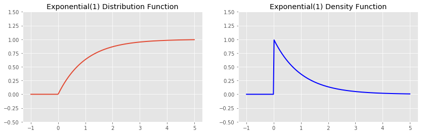
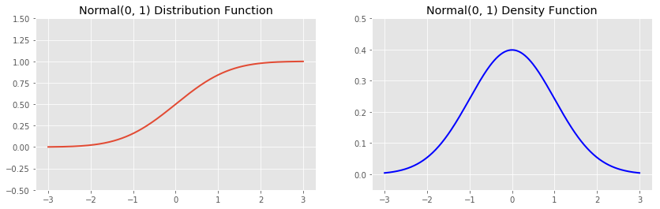
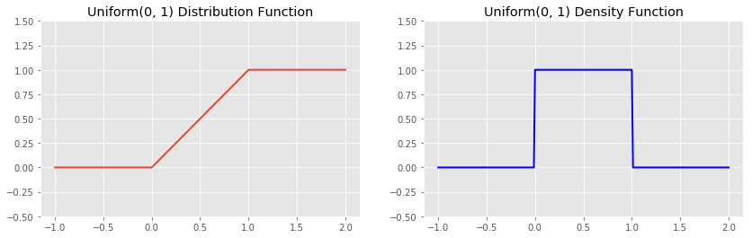
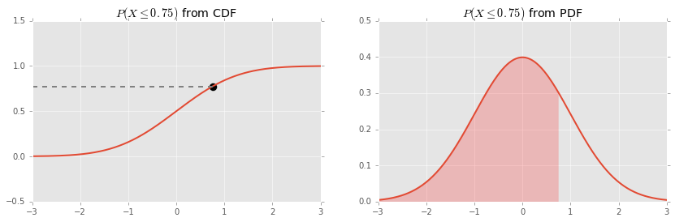

# Define and work with CDFs and PDFs

## Make valid probabilistic statements using random variables' distribution and density functions

A nice way to conceptualize the idea of a random variable \\(X\\) is as an object that can be used to 
generate numbers in such a way that valid probabilistic statements about the generated numbers can be made.  
For example, statements such as

$$ Pr(X > 0) = 0.5 $$

$$ Pr(-1 < X < 1) = 0.25 $$

$$ Pr(X < 0) = 0 $$

$$ Pr(X > 1 \mid X > 0) = 0.5 $$

are all probabilistic statements about the (as of yet) unknown outcome of a random variable.

As a programming analogy, a random variable is a type of object that implements a single method, `sample`:

```
class RandomVariable(object):

    def __init__(self, parameters):
        self._parameters = parameters

    def sample(self, n):
        '''Return a random sample of size n from the variable.'''
        return algorithm_for_sampling_from_this_variable(n)
```

We can interpret our "valid probabilistic statements about the generated numbers can be made" statement in this context 
by thinking about what happens when we call `sample` repeatedly.  I.e., with respect to the long term 
frequency behavior of such samples.  This perspective forms the basis for the most mainstream branch
of statistics known as _frequentist_ or _classical statistics_, which is to be contrasted with 
_Bayesian analysis_.  But we shall return to this conversation later.  For now, consider the following:

```
def estimate_probability_between_two_numbers(X, a, b):
    """Approximate the probability that X is between a and b"""
    return np.sum(a <= X.sample(A_BIG_NUMBER) < b) / A_BIG_NUMBER
```

Notice that for this to work we want repeated calls to `estimate_probability_between_two_numbers` 
(with the same arguments) to always give approximately the same answer 
(and exactly the same answer if `A_BIG_NUMBER` is infinity).

### Distribution and Probability Density Functions

One very general probabilistic statement we can make about a random variable is to compute the function 

$$ F_X(t) = Pr(X \leq t) $$  

for all values of \\(t\\).  This is called the _cumulative distribution_ (or just _distribution_) function, 
often abbreviated _CDF_ (for cumulative distribution_ function) of the random variable \\(X\\) 
(as notated by the subscript \\(X\\) on the \\(F_X(t)\\)).  
The distribution function keeps track of the probabilities that a number sampled from random variable 
does not exceed the threshold \\(t\\).

If the distribution function of a random variable \\(X\\) 
is differentiable, then its derivative, \\(f_X(t) = F_X'(t)\\) 
is called the _probability density function_ (abbreviated _PDF_ in many places).

The probability density function (if it exists) satisfies the following property
(which is actually just a restatement of the 
[Fundamental Theorem of Calculus](https://en.wikipedia.org/wiki/Fundamental_theorem_of_calculus))

$$ Pr(a < X \leq b) = \int_{a}^{b} f_X(t) dt $$


<div class="bg-warning" style="padding-left:8px;padding-right:8px;padding-top:8px;padding-bottom:8px">
<strong>Programming Note</strong>

In python, objects that represent random variables are found in <code>scipy.stats</code>, e.g.:

<pre>
from scipy.stats import norm
standard_normal = norm(loc=0, scale=0)

# The distribution function
standard_normal.cdf(0.75)
# The density function
standard_normal.pdf(0.75)
</pre>

</div>


We've actually already met a few common distributions, so let's here
consider their cumulative distribution and probability density functions:








Notice that every distribution function increases monotonically from (a limit of) zero to (a limit of) 1. 
This is because it is tracking the probability that a random variable is less than or equal to \\(t\\). 
When \\(x\\) equals the minimum value of the density function, that probability is 0; 
when \\(x\\) equals the maximum value of the density function, that probability is 1.

The distribution and probability density functions give us two methods for 
calculating the probabilities associated with a random variable:

  - We can calculate probabilities from the distribution function by simply plugging in values

$$ Pr(a < X \leq b) = F_X(b) - F_X(a) $$

  - We can calculate probabilities from the density function by calculating the area under the density function

$$ Pr(a < X \leq b) = \int_{0}^{b} f(t) dt $$




### !challenge

* type: number
* id: 4dbef286-fd9e-4564-bb52-e53c06d8a9f2
* title: Sampling and Estimation Q1
* decimal: 3

##### !question

Given a standard normal distribution with mean 5 and standard deviation 3, what is \\(Pr(X<3)\\)?

##### !end-question

##### !placeholder

Enter your answer rounded to 3 decimal places.

##### !end-placeholder

##### !answer
0.252
##### !end-answer

##### !explanation

Create a normal distribution as above, using the given mean and standard deviation.
The cumulative density function will tell you the probability that \\(X\\) is less than the value you pass in.

```
In [4]: dist = norm(5,3)

In [5]: dist.cdf(3)
Out[5]: 0.25249253754692291
```


##### !end-explanation

### !end-challenge

### !challenge

* type: number
* id: 092ef1fd-dc80-4722-88e9-480c064618a9
* title: Sampling and Estimation Q2
* decimal: 3

##### !question

Given a standard normal distribution with mean 5 and standard deviation 3, what is \\(P(1<X<3)\\)?

##### !end-question

##### !placeholder

Enter your answer rounded to 3 decimal places.

##### !end-placeholder

##### !answer
0.161
##### !end-answer

##### !explanation
We already know the probability that X is less than 3. In order to eliminate the portion of that that is also less than 1, we need to determine \\(Pr(X<1)\\) and find the difference.

```
In [6]: dist.cdf(1)
Out[6]: 0.091211219725867876

In [8]: dist.cdf(3) - dist.cdf(1)
Out[8]: 0.16128131782105504
```

##### !end-explanation

### !end-challenge

### !challenge

* type: code-snippet
* language: python2.7
* id: b1162040-8cdc-4d65-bd79-79304ecee899
* title: Sampling and Estimation Q3


### !question

Write a function that take in a mean, standard deviation, and range of values (min and max). Given a standard normal distribution with that mean and standard deviation, return the probability that \\(X\\) falls within the range.

### !end-question

### !placeholder

```python


def probability_between(mean, sd, a, b):
    pass

```

### !end-placeholder
### !tests
```python

import main
import unittest


class TestPython1(unittest.TestCase):
      def test_probability_between(self):
        result = main.probability_between(5,5,-1,0)
        correct = 0.04358558
        self.assertEqual(round(result, 5), round(correct, 5))

```
### !end-tests

### !explanation

### !end-explanation

### !end-challenge

