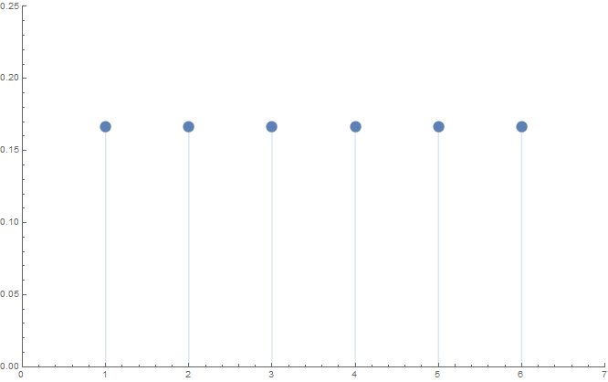
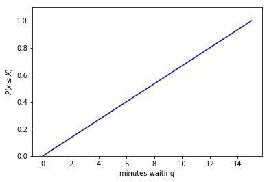
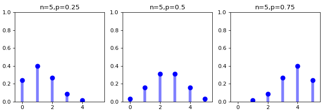
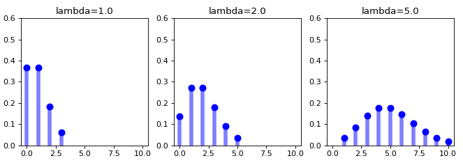

# Probability Mass Functions

So you may be feeling a little bit off -- like something is missing -- or you may have 
directly taken notice of a couple points (the first explicit, and the second implicit):

* The PDF \\(f_X(t)\\) exists only if the CDF \\(F_X(t)\\) is differentiable, in which case \\(f_X(t) = F_X'(t)\\)

* There are not only continuous distributions -- there are also discrete distributions -- and these were missing in the last section! 

So how do these two points come in to play? Well, it turns out that continuous random variables
have PDFs and discrete random variables don't.  But the cool thing is that discrete random variables
still have CDFs.  But of course they do: it should always be possible to conceptualize the statement \\(Pr(X \leq t)\\).
In this sense, we might view CDFs as a much more central object for random variables, since the CDF
will exist for any random variable while a PDF only exists for continuous random variables. 

So if discrete random variables don't have PDFs, then what do they have?  They have something -- we've  
seen them previously (e.g., for the Bernoulli, geometric, binomial, Poisson distributions...). 
Well, it turns out discrete random variables have what's called _probability mass functions_
(often simply referred to as PMFs).  Probability mass functions are the discrete random variables analog 
to the probability density functions of continuous random variables.  
But again, cumulative distribution functions exist for both discrete and continuous 
random variables. So the two types of random variables (the continuous and discrete) lead to two 
different types of probability specifications that are related in the sense that both can be used to produce 
the CDF that is common to any random variable. 

As previously discussed, probability mass functions are used differently than 
probability density functions.  Probability mass functions give actual probabilities 
for each possible outcome \\(x\\) in the sample space \\(S_X\\) of a random variable \\(X\\)
(and probability 0 for outcomes that aren't in \\(S_X\\)).
So for probability mass functions we often see the notation \\(Pr(X = x)\\)
which indicates the probability of realizing an outcome \\(x\\) from the random variable \\(X\\).
Such statements don't make sense don't make sense for probability density functions 
which give probabilities for areas under curves.  There is no area under a curve at a single point!
Do not be too concerned about this though.  A probability density function gives us a practical and 
useful way to model real-valued random phenomenon that works really nicely and conveniently.  Mathematical models 
are NOT meant to BE truth, they are just meant to help us reasonably model and thus harness the real world 
(and probability density functions can this for us!).  But it is nice that probability mass functions
are a little bit easier to think about since we can use them to just directly make statements 
about exact outcomes, i.e., \\(Pr(X = x)\\).


The simplest probability mass function is the uniform distribution,
where each of a set of possible discrete outcomes is equally likely.
For example, a random variable representing the flipping of a coin with outcomes labeled as `0` and `1`
(assuming the coin is fair) would have a uniform probability mass function \\(Pr(X = 0) = Pr(X = 1) = \frac{1}{2}\\)
(and assign probability 0 to all other outcomes). 
Or another example would be a random variable representing the roll of an unloaded (i.e., fair) 
6-sided die (with face values 1 through 6) which would have a probability mass function of 
\\(Pr(X = x) = \frac{1}{6}\\) for \\(x = 1, \cdots, 6\\) (and assign probability 0 to all other outcomes). Here is the probability mass function for a fair 6-sided die: 

>


#### !challenge
* type: paragraph
* id: scott_dists_4
* title: Discrete Uniform
#### !question


Qualitatively describe what the cumulative distribution function of the 'fair 6-sided die' random variable looks like?

Hint: if you roll a 6-sided die once, what is the probability the face value will be 6 or smaller? 
What is the probability the face value will be 3 or smaller? What is the probability the face value will be 1 or smaller? 
Instinctively, you were probably able to answer: 6/6 or 1, 3/6 or 0.5, and 1/6 or ~.167. 
We are summing the 1/6 probability for numbers up to and including the upper bound.  
And with that in mind, don't forget that the definition of the cumulative distribution function 
is the cumulative probability of observing an outcome less than or equal to \\(t\\), i.e., 
\\(Pr(X \leq t)\\). 

So again -- what that in mind -- describe what the cumulative distribution function of the 'fair 6-sided die' random variable looks like!


#### !end-question
#### !explanation

It looks like a stair case! 


#### !end-explanation
#### !end-challenge


#### !challenge
* type: paragraph
* id: scott_dists_5
* title: Continuous Uniform
#### !question

Suppose a bus arrives every 15 minutes, and you arrive at a bus stop with no knowledge of the schedule.
In this case the amount of time you'll need to wait for the bus is also uniformly distributed.
Qualitatively describe what the cumulative distribution function would be for a random variable
representing this phenomenon.  

Hint: you might need to wait 2 minutes and 12.3627... seconds; or, you might need to wait 13 minutes and 53.1837... seconds. 
In standard parlance we would probably think of report these durations as discrete measurements rounded to the nearest minute
(e.g. 2 minutes, 14 minutes), but is this for of reporting correct, technically?

#### !end-question
#### !explanation

The cumulative distribution function for this continuous uniform random variable
looks like the \\(Y=X\\) line! 

>

But of course this is because this is a continuous uniform distribution,
not a discrete uniform distribution.  So the random variable in question does not
have a probability MASS function, it instead has the following probability DENSITY function!

>

#### !end-explanation
#### !end-challenge


#### !challenge
* type: paragraph
* id: scott_dists_6
* title: PDF VS PMF
#### !question

What would you say to someone to describe the difference between 
probability mass functions and probability density functions? 

For example,
```python
>>> from scipy import stats
>>> stats.uniform.pdf(3, 1, 4)
0.25
>>> stats.randint.pmf(3, 1, 4+1)
0.25
```

#### !end-question
#### !explanation

Probability density functions are used to describe 
outcome probabilities associated with continuos random variables using
an "area under the curve" model; whereas probability mass functions provide
actual probabilities defining the chances of observing specific outcomes.

So, for example, \\(Pr(1 < X < 2)\\) is something that make sense to calculate 
on the basis of a probability density function.  But \\(Pr(X = 2)\\) is not
something makes sense to calculate for a probability density function
since there's no "area under the curve" at just a single specific point;
however, \\(Pr(X = 2)\\) does make sense as a value for a 
probability mass function since these specify probabilities for specific 
discrete value outcomes. Nonetheless, the relative values of a probability 
density function \\(f_X(X)\\) do in fact say something about the relative 
frequency of types outcomes close to a specific value. 
For example, if \\(f_X(X=x_0) = 2*f_X(X=x_1)\\) then
outcomes close to \\(x_0\\) are approximately twice as likely 
to be observed compared to values close to \\(x_1\\).
 
#### !end-explanation
#### !end-challenge


Probability mass functions are used more commonly 
than their associated cumulative distribution functions
for characterizing discrete random variables. 
This is because probabilities can be be calculated directly based 
on probability mass functions; whereas for continuous random variables 
it is the cumulative distribution function that directly provides 
probabilities (since the probability density functions must be integrated
over to provide probabilities). So given that this is the case, definitely 
for discrete random variables we most commonly focus on 
probability mass functions rather than cumulative distribution functions.
So, for example, some example binomial and Poisson probability mass functions 
(two distributions we have already encountered) are: 



(Example binomial probability mass functions)

<br>



(Example Poisson probability mass functions)

#### !challenge
* type: paragraph
* id: scott_dists_extra
* title: Binomial and Poisson distributions 
#### !question

Describe a common experimental use case for the 
binomial and Poisson distributions.  

Hint: feel free to consult an outside resource (wikipedia is a great choice for this!)
if you need a little reminder about what these distributions are often used for.

#### !end-question
#### !explanation
 
#### !end-explanation
#### !end-challenge


## Wrap Up

There are discrete and continuous random variables and both have 
cumulative distribution functions, but the former have 
probability mass functions and the latter have probability density functions.
Here we've explored the most relevant characteristics distinguishing PDFs and PMFs
(and by extension, CDFs),  
and we've done that without focusing on associated mathematical definitions and operations.
But of course these mathematics are still here and underpin everything that
we can do with CDFs, PDFs and PMFs. The next few sections will begin to 
address the mathematical considerations of probability distributions!


