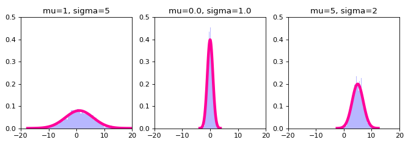

# Distribution parameters

Recall that \\(\operatorname{E}_X[X]\\) is a function of its argument that depends on the 
distribution of the random variable \\(X\\).  And further recall, as addressed in one of the 
problems from the previous section, that this value is a deterministic constant once 
the distribution is given.  I.e., the characteristics \\(\operatorname{E}_X[X]\\) or \\(\operatorname{Var}[X]\\) 
(for example) of a distribution are not random variables but just constant numbers quantifying something 
about a distribution; here, the location (mean) and spread (variance), respectively,
of the random variable \\(X\\).

The notion that a characteristic of a probability distribution of some random variable \\(X\\)
should be a fixed constant value probably doesn't seem that strange.  Actually, it's a pretty natural idea.
A distribution is a thing and it is specified in some certain way and it makes
sense that these specifications would need to chosen and fixed. It is then the random outcome \\(x\\)
of the random variable \\(X\\) that this distribution describes the behavior of that 
has uncertainty and randomness -- not the distribution of the random variable describing 
this uncertainty and randomness itself.  

This can be even further conceptualized if we think of the distribution as modeling a _population_ of some kind.  
I.e., a collection of individuals on which observations can be made.  So, for example, the population of heights of all people;
or, the population of all incomes in the US.  And indeed, distributions are exactly used to model populations
from which we will draw random samples, so this is a completely straight forward idea.   
But if we follow this idea out to its logical conclusion 
then there are certain characteristics of the population (such as the average height
or average income) that, for a given point in time, are just a fixed number that we could 
theoretically calculate if we measured every individual in the population.  

While at first presentation it seems quite reasonable to be operationally centric on the expectation operator 
\\(\operatorname{E}\_X[X]\\) and a "fixed constant" interpretation of the characteristics of a probability 
distribution, this is actually not the only way that we might go about conceptualizing things;
however, it is a very tradition and standard approach for doing so.  Indeed, this interpretation
is part of the classical or frequentist statistical paradigm.  
As noted previously, the alternative paradigm is known as
Bayesian inference, but we will again postpone our exposition comparing and contrasting these two schools of thought
to a later time. For now, we will focus on the classical, or frequentist view on populations which conceptualizes their 
defining characteristics as fixed constants.  

Within the context of a mathematical specification of a probability distribution, there are certain
key defining characteristics by which a distribution (or the population it is representing) is _parameterized_.
Sometimes these _parameters_ equate to the characteristics such as the mean \\(\operatorname{E}_X[X]\\) 
and variance \\(\operatorname{Var}[X]\\) of the distribution, but not always. 
While it is reasonable to call any characteristic of a probability distribution "a parameter" of the
distribution, the term "parameter" is mostly reserved for the (usually) greek letters that are used to index
into a family of distributions. I.e., they are the things that distinguish, e.g., one normal distribution from 
another normal distribution.  But what these parameters actually mean (i.e., how they can be interpreted) with respect to how they characterize their distribution is specific to the family of distributions in question.  
Okay, that was a lot text...
let's now try to make all of this verbiage concrete by working directly with an example: 

As defined previously, the probability density function for a continuous random variable \\(X\\) 
that follows a normal (or Gaussian) distribution is

   $$ f_X(X=x) = \frac{1}{\sqrt{2\pi\sigma^2}}exp\left(-\frac{(x - \mu)^2}{2\sigma^2}\right) \text{ for } x \in (-\infty, \infty) $$

The greek letters \\(\mu\\) and \\(\sigma^2\\) in this expression are the _parameters_ of the family of normal 
distributions, and different normal distributions will have different values for their parameters.  For example,
consider the following distinct normal distributions: 

>

Now, interestingly, it turns out that for a normally distributed random variable \\(X, \operatorname{E}_X[X] = \mu\\) and
\\(\operatorname{Var}[X] = \sigma^2\\).  So in this case the parameters of the distribution correspond exactly to 
our two very familiar and meaningful expectation calculations.  But again, this need not always be the case.  
For example, as previously defined, the probability mass function for a discrete random variable \\(X\\)
that follows a binomial distribution is

$$ Pr(X=x) = {n \choose x}p^x(1-p)^{n-x}, \text{ for } x \in \{0, 1,... n\} $$

and here the parameters of the family of binomial distribution are (this time not greek letters) \\(n\\) and \\(p\\).
But for a binomially distributed random variable \\(X, \operatorname{E}_X[X] = np\\) and \\(\operatorname{Var}[X] = np(1-p)\\).
So the parameters of a binomial distribution themselves do not exactly correspond to our familiar expectation calculations.
On the other hand, it does also turn out to be the case that, e.g., \\(\operatorname{E}_X[\frac{X}{n}] = p\\), 
so a parameter _per se_ is always linked to a idiosyncratic expectation specification.


### !challenge
* type: multiple-choice
* id: params_11
* title: Standard deviation
### !question
What is the standard deviation of a random variable that is distributed as a normal distribution with parameters \\(\mu\\) and \\(\sigma^2\\)?
### !end-question
### !options
* (a) \\(\sqrt{\operatorname{Var}[X]}\\)
* (b) \\(\sigma\\)
* (c) \\(\sqrt{\operatorname{E}_X\left[(X-\operatorname{E}_X[X])^2\right]}\\)
* (d) all of the above
* (e) none of the above
### !end-options
### !answer
(d) all of the above
### !end-answer
### !explanation
Answers (a) and (c) are of course definitional, and answer (b) follows directly from (a) 
given that \\(\operatorname{Var}[X] = \sigma^2\\) for a normally distributed random variable.
### !end-explanation
### !end-challenge

As previously defined, the probability mass function for the poisson distribution is 

$$ Pr(X=x) = \frac{\lambda^x e^{-\lambda}}{x!},\text{ for } k \in \{0,1,2,...\} $$

and it turns out that for a random variable \\(X\\) that is distributed 
according to a Poisson distribution \\(\operatorname{E}_X[X] = \operatorname{Var}[X] = \lambda\\).


### !challenge
* type: multiple-choice
* id: params_21
* title: Standard deviation
### !question

Clearly, the mean and variance of a normal distribution can be independently specified, while for a 
Poisson distribution they are determined by exactly the same parameter so they definitely cannot 
be independently specified.  In this regard, is there a fundamental difference in the deterministic 
relationships between the mean and variance as specified in the binomial distribution versus the Poisson distribution? 
I.e., is the relationship between the mean and variance 
in the binomial distribution more flexible than the same relationship in the Poisson distribution?
Or do the relationships in some induce a similar type of restriction?

### !end-question
### !options
* The flexibility in the specificaiton of the mean and the variance for the binomial distribution is more akin to that of the normal distribution as opposed to the Poisson distribution 
* The mean-variance relationship is fundamentally the same between for the Poisson and binomial distributions
### !end-options
### !answer
The mean-variance relationship is fundamentally the same between for the Poisson and binomial distributions
### !end-answer
### !explanation
In a Poisson distribution \\(\operatorname{E}\_X[X] = \operatorname{Var}[X] = \lambda\\) 
while in a binomial distribution \\(\operatorname{E}\_X[X] = np\\) and \\(\operatorname{Var}[X] = np(1-p)\\).
In fact these entail the same sort of fundamental restriction; namely, once the mean is specified,
there is no longer any freedom in which to specify the variance.
This is of course not true for the normal distribution where the mean and variance 
may be specified independently. 
### !end-explanation
### !end-challenge


#### !challenge
* type: paragraph
* id: params_31
* title: Poisson expectation
#### !question

What is the analytical calculation that produces the final results
\\(\operatorname{E}_X[X] = \operatorname{Var}[X] = \lambda\\)?

Hint 1: You do not have to actually prove these results -- just set up the 
formal calculations (i.e., definitions) for the expectation and the variance. 

Hint 2: this is just a question about how you definitely specify
expectation and variance for a random variable that has a Poisson distribution.  
We already know these calculations yield \\(\lambda\\) but what is the actual 
calculation set up?

#### !end-question
#### !explanation

$$ \operatorname{E}\_X[X] = \sum_{x=0}^{\infty} x \frac{\lambda^x e^{-\lambda}}{x!}  $$

$$ \operatorname{Var}[X] = \sum_{x=0}^{\infty} (x - \lambda)^2 \frac{\lambda^x e^{-\lambda}}{x!}  $$

And of course \\(\operatorname{E}\_X[X] = \lambda\\) which is why \\(\lambda\\) appears inside
\\((x - \lambda)^2\\) in the second equation rather than \\(\operatorname{E}\_X[X]\\).

It's quite interesting these two summations analytically calculate about to \\(\lambda\\), no? 
#### !end-explanation
#### !end-challenge


As previously defined, the probability mass function for the geometric distribution is 

$$ (1-p)^{x-1}p, \text{ for } x \in \{1,...\} $$

and it turns out that for a random variable \\(X\\) that is distributed 
according to a geometric distribution \\(\operatorname{E}_X[X] = \frac{1}{p}\\).


#### !challenge
* type: paragraph
* id: params_41
* title: Geometric expectation
#### !question

Prove analytically that for a random variable \\(X\\) with a geometric distribution,
\\(\operatorname{E}_X[X] = \frac{1}{p}\\).

Hint 1: use \\(q = 1-p\\) and factor the expectation to make it look like a geometric series for the solution.  
I.e., the geometric series has an analytical, closed-form. 

Hint 2: give it your best shot here, but if you're really struggling to figure out what to do
then just submit an answer and study the solution!  This is a great way to learn and improve! 
#### !end-question
#### !explanation

For a random variable \\(X\\) with a geometric distribution

$$
\begin{align}
\operatorname{E}\_X[X] &= \sum_{x=1}^{\infty} x (1-p)^{x-1}p \\\\
&= \sum_{x=1}^{\infty} x q^{x-1}(1-q) \\\\
&= \sum_{x=1}^{\infty} x q^{x-1}  - \sum_{x=1}^{\infty} x q^x \\\\
&= \sum_{x=0}^{\infty} (x+1) q^{(x+1)-1}  - \sum_{x=0}^{\infty} x q^x \\\\
&= \sum_{x=0}^{\infty} (x+1) q^{x}  - \sum_{x=0}^{\infty} x q^x \\\\
&= \sum_{x=0}^{\infty} (x+1-x) q^{x} \\\\
&= \sum_{x=0}^{\infty} q^{x} \\\\
&= \frac{1}{1-q} \text{ (by the geometric series)} \\\\
&= \frac{1}{p}
\end{align}
$$

#### !end-explanation
#### !end-challenge


### !challenge
* type: multiple-choice
* id: params_51
* title: Standard deviation parameterization
### !question
The normal distribution is often parameterized based on parameters \\(\mu\\) and \\(\sigma^2\\).
Would it not also be possible to parameterize it based on parameters \\(\mu\\) and \\(\sigma\\)?
I.e., based on the standard deviation rather than the variance? 
### !end-question
### !options
* No, normal distributions can only be parameterized on the basis of the variance \\(\sigma^2\\)
* Yes, of course we could choose to specify a normal distribution based on a standard deviation \\(\sigma\\) specification
### !end-options
### !answer
Yes, of course we could choose to specify a normal distribution based on a standard deviation \\(\sigma\\) specification
### !end-answer
### !explanation
Well it's quite trivial to see that \\(\sigma^2 = (\sigma)^2\\), so specifying the standard deviation
is equivalent to specifying the variance.  
### !end-explanation
### !end-challenge

As the previous problem clarifies, parameterizations are arbitrary and there are an infinite number of 
alternative versions.  For example, depending on which area of statistics you're working in
the normal distribution is parameterized by the variance \\(\sigma^2\\), 
the standard deviation \\(\sigma\\), 
or the so-called _precision_ \\(\phi = \frac{1}{\sigma^2}\\). 
In `scipy.stats` the `scale` parameter for the normal distribution `scipy.stats.normal` is
the standard deviation.  So `scipy.stats` in Python parameterizes the normal distribution 
with the standard deviation as opposed to the variance (or the precision). 
Another example is the gamma distribution.  


The probability density function for a geometric distribution (which we have not seen yet) is frequently
presented (i.e., parameterized) in two different ways: 

* _Version 1_ of the gamma distribution is parameterized by the _shape_ \\(k\\) and the _scale_ \\(\theta\\): 

$$ \frac{1}{\Gamma(k)\theta^k}x^{k-1} e^{-\frac{x}{\theta}} $$

* _Version 2_ of the gamma distribution is parameterized by the _shape_ \\(\alpha\\) and the _rate_ \\(\beta\\): 

$$ \frac{\beta^\alpha}{\Gamma(\alpha)}x^{\alpha-1} e^{-x\beta} $$

As this indicates, the _scale_ and the _rate_ (i.e., the inverse of the _scale_) are alternative forms by which to
parameterize the gamma distribution. 


#### !challenge
* type: paragraph
* id: params_61
* title: Geometric expectation
#### !question

The [exponential distribution](https://en.wikipedia.org/wiki/Exponential_distribution) and 
[chi-squared distribution](https://en.wikipedia.org/wiki/Chi-squared_distribution)
are special cases of the [gamma distribution](https://en.wikipedia.org/wiki/Gamma_distribution).
Explain what gamma distribution specifications these distributions correspond to.

#### !end-question
#### !explanation

The probability density function for an exponential distribution with parameter \\(\lambda\\) is

$$ \lambda e^{-\lambda x}, \text{ for } x \in (0, \infty) $$

which corresponds to a gamma distribution with shape parameter `1` and rate parameter \\(\lambda\\).

The probability density function for an chi-squared distribution with parameter \\(k\\) is

$$ \frac{1}{\Gamma(\frac{k}{2})2^{\frac{k}{2}}}x^{\frac{k}{2}-1} e^{-\frac{x}{2}} $$

which corresponds to a gamma distribution with shape parameter \\(\frac{k}{2}\\) 
and rate parameter \\(\frac{1}{2}\\).

#### !end-explanation
#### !end-challenge


### !challenge
* type: code-snippet
* language: python2.7
* id: params_71
* title: Gamma distribution 
### !question

The SciPy implementation of the gamma distribution uses the shape (specified as `a`, 
which is actually a fairly confusing choice...) 
and scale (as opposed to rate) parameterization.  Instantiate a gamma distribution such that

```python
>>> from scipy import stats
>>> gamma_rv = stats.gamma(a = ..., scale = ...)
>>> gamma_rv.mean()
50.0
>>> gamma_rv.var()
500.0
```

Hint: you might want to look up what the mean and variance of a gamma distribution 
are as a function of the distributions specification parameters (as usual, 
wikipedia is a good source for this information!).

Once you've gotten this specific challenge figured out see if you can play around with the 
parameter specifications to produce whatever mean and variance you want 
for a gamma distribution. And once you've done this for a gamma distribution
you should try to tinker around with the parameters of some 
[other distributions](https://docs.scipy.org/doc/scipy/reference/tutorial/stats.html)
and see if you can't do the same there.

### !end-question

### !placeholder

```python
from scipy import stats

def gamma_mean_and_variance():
    shape = 1 # these are not yet correct
    rate = 1 # these are not yet correct
    gamma_rv = stats.gamma(a = shape, scale = 1./rate)
    return gamma_rv.mean(), gamma_rv.var()
```

### !end-placeholder
### !tests
```python

import main
import unittest
from scipy import stats

class TestPython1(unittest.TestCase):
      def test_gamma_mean_and_variance_MEAN(self):
        result = main.gamma_mean_and_variance()
        correct = 50.0, 500.0
        self.assertEqual(result[0], correct[0])

      def test_gamma_mean_and_variance_VARIANCE(self):
        result = main.gamma_mean_and_variance()
        correct = 50.0, 500.0
        self.assertEqual(result[1], correct[1])
```
### !end-tests

### !explanation
### !end-explanation
### !end-challenge

# Wrap Up

Okay, in this quite substantive (i.e., large) section we've discussed the notion of parameters 
that define a specific instance of a distribution. Good job on making it through this section --
it is a very dense section.  A very nice (and quite advanced) resource of the kind you'll want to keep 
around for easy reference regarding these topics is this awesome
[distribution cheat sheet](http://www.cs.elte.hu/~mesti/valszam/kepletek.pdf).

In closing, a very common notation for expressing the distribution of a random variable \\(X\\)
that you should be familiar with is, e.g.,

$$ X \sim Poisson(\lambda) \quad\text{ or }\quad X \sim Normal(\mu, \sigma^2) $$ 

This notation specifies the distribution of the random variable by name, and 
then specifies the value of the parameters.  Related to this notation, it is also 
common to indicate the distribution of a random variable as 
through the somewhat abusive use notation 

$$ Pr(X|\lambda) = Poisson(\lambda) \quad\text{ or }\quad f_X(X|\mu, \sigma^2) = Normal(\mu, \sigma^2) $$ 

as opposed to actually writing out the probability mass function or probability density function 
math since this is understood by naming the distribution explicitly. 
