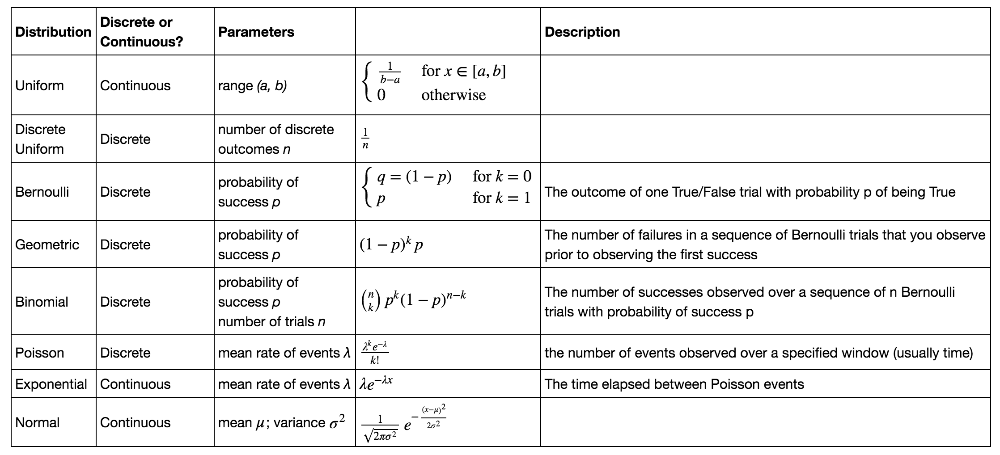

# Probability Review

Okay, time to review the basic components of probability vital to becoming a data scientist. 
It's the content that builds off of these components -- probability and statistics, and eventually 
predictive modeling tools -- that makes you different from a software engineer, 
so it's crucial that you have a solid understanding of these core concepts:

  - Conditional probability and Bayes formula
  - Counting: permutation/combination (python module: `itertools`)
  - Probability distributions for discrete random variables (e.g., uniform, Bernoulli, binomial, geometric and Poisson distributions)
  - Probability distributions for continuous random variables (e.g., uniform, normal, exponential, and gamma distributions)
  - Generating simulations in python (python module `scipy` and in particular `scipy.stats`)

While we have by now already introduced the core topics relevant to the above competencies, 
refreshing and reinforcing your learning really is the only way to develop expertise in these
areas. There just really isn't any such thing as a shortcut with respect to developing a deep
understanding of these topics.  And again, like it our not, these topics make up the foundation 
that is fundamental to becoming a data scientist; indeed, evaluation of expertise in these
topics nearly always serves as a first pass screening tool for candidate selection in the
interview processes for data science positions.  I.e., these topics make up a very standard 
stage rite of passage in terms of the data science career path and there's no getting around that.  

So, in order to sanity check and fill in any holes there may be in your current level of understanding 
you should first work through and review the following outstanding mini-lectures.  
Then after that we will  continue on to some problems to test and practice your understanding.

 - [combinatorics lecture](resources/combinatorics_lecture.pdf)
 - [conditional probability lecture](resources/conditional_probability_lecture.pdf)
 - [random variables lecture](resources/random_variables_lecture.pdf)
 - [binomial distribution lecture](resources/binomial_lecture.pdf)
 - [poisson distribution lecture](resources/poisson_lecture.pdf)
 - [normal and exponential distributions lecture](resources/normal_exponential_lecture.pdf)

These are all available in the [resources folder](resources/).
And a nice summary of the mathematical specifications of all distributions we've encountered so far is:

(and of course don't forget our awesome [distribution cheat sheet](http://www.cs.elte.hu/~mesti/valszam/kepletek.pdf))

Finally, if you're still grappling with the above concepts, that's okay -- this is a learning process --
and embracing the struggle and seeking true, real growth is what it's all about!
In that regard, Khan Academy offers a very nice [probability course](https://www.khanacademy.org/math/probability) 
online (for free!) that you can use to continue to systematically work through the fundamentals.

And of course you can always seek out additional resources on which to anchor and build your knowledge
base. 
Actually -- and this is a HUGE point -- being able to do so is a fundamental skill that you're absolutely 
have to have in order to continue being successful going forward. 
So don't be afraid to start getting good and tracking down resources and figuring them out RIGHT NOW!
"Practice doesn't make perfect -- perfect practice makes perfect"!
