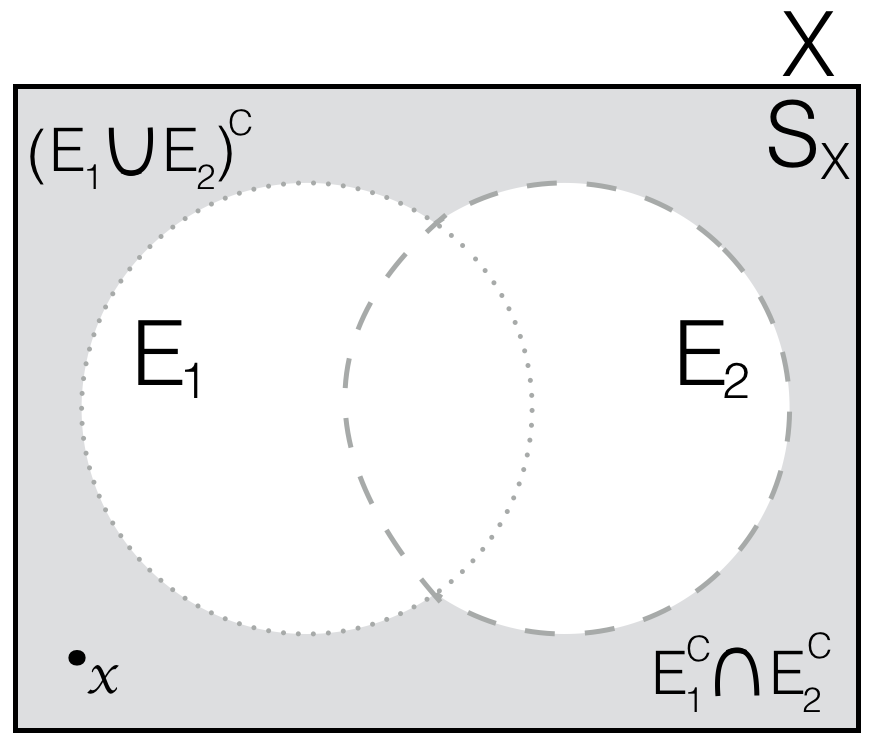
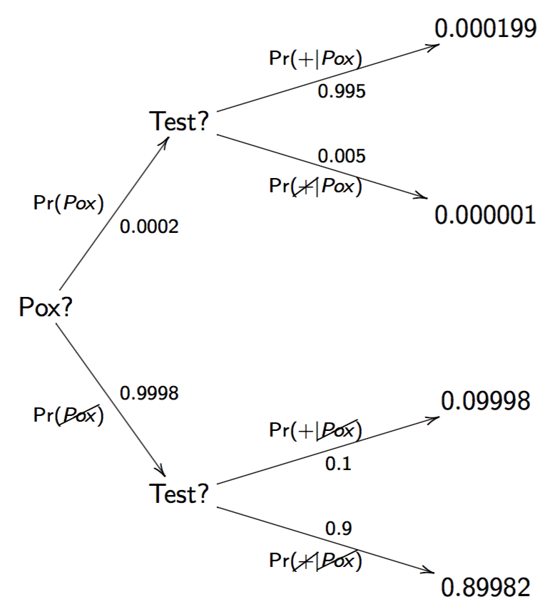

## 0. Warm Up

To get warmed up, let's begin with quick refresher on the absolute 
basics in terms of probability concepts. 

### !challenge
* type: multiple-choice
* id: scott_pc2_rev1
* title: Review Problem #1 
### !question
Which of the following best represents the notion of a _Venn diagram_?
### !end-question
### !options
* (a) A random phenomenon to be measured, usually denoted as \\(X\\)
* (b) The observed result of a random phenomenon, usually denoted as \\(x\\)
* (c) A graphical tool used to visually represent events within their context
* (d) The set of all possible outcomes that might result from a random phenomenon measurement
* (e) A sequential representation possible event outcomes based on the chain rule
### !end-options
### !answer
(c) A graphical tool used to visually represent events within their context
### !end-answer
### !explanation

Here is the most famous example of a Venn diagram.  Do you remember what laws these diagrams
represent? 

<table style="width:100%;">
  <tr>
    <td style="text-align: center;"></td>
    <td style="text-align: center;"></td>
  </tr>
  <tr>
    <td style="text-align: center;">Complement of the Union</td>
    <td style="text-align: center;">Complement of the Intersection</td>
  </tr>
</table>

### !end-explanation
### !end-challenge

### !challenge
* type: multiple-choice
* id: scott_pc2_rev2
* title: Review Problem #2
### !question
Which of the following best represents the statistical notion of an _outcome_?
### !end-question
### !options
* (a) A random phenomenon to be measured, usually denoted as \\(X\\)
* (b) The observed result of a random phenomenon, usually denoted as \\(x\\)
* (c) A graphical tool used to visually represent events within their context
* (d) The set of all possible outcomes that might result from a random phenomenon measurement
* (e) A sequential representation possible event outcomes based on the chain rule
### !end-options
### !answer
(b) The observed result of a random phenomenon, usually denoted as \\(x\\)
### !end-answer
### !explanation
Yep: observed outcomes are generally denoted as \\(x\\). 
### !end-explanation
### !end-challenge

### !challenge
* type: multiple-choice
* id: scott_pc2_rev3
* title: Review #3
### !question
Which of the following best represents the statistical notion of an _experiment_?
### !end-question
### !options
* (a) A random phenomenon to be measured, usually denoted as \\(X\\)
* (b) The observed result of a random phenomenon, usually denoted as \\(x\\)
* (c) A graphical tool used to visually represent events within their context
* (d) The set of all possible outcomes that might result from a random phenomenon measurement
* (e) A sequential representation possible event outcomes based on the chain rule
### !end-options
### !answer
(a) A random phenomenon to be measured, usually denoted as \\(X\\)
### !end-answer
### !explanation
Coinciding with the use of \\(x\\) to notate outcomes observed
in a statistical experiment, generally \\(X\\) is used to notate 
the random outcome before it has been realized. I.e., 
\\(X\\) is used to notate a statistical experiment.
### !end-explanation
### !end-challenge

### !challenge
* type: multiple-choice
* id: scott_pc2_rev4
* title: Review problem #4
### !question
Which of the following best represents the statistical notion of a _sample space_?
### !end-question
### !options
* (a) A random phenomenon to be measured, usually denoted as \\(X\\)
* (b) The observed result of a random phenomenon, usually denoted as \\(x\\)
* (c) A graphical tool used to visually represent events within their context
* (d) The set of all possible outcomes that might result from a random phenomenon measurement
* (e) A sequential representation possible event outcomes based on the chain rule
### !end-options
### !answer
(d) The set of all possible outcomes that might result from a random phenomenon measurement
### !end-answer
### !explanation
And don't forget that the sample space 
is usually notated as \\(S_X\\) for some experiment \\(X\\) whose actual observed 
outcome will be notated as \\(x\\).
### !end-explanation
### !end-challenge

### !challenge
* type: multiple-choice
* id: scott_pc2_rev5
* title: Review problem #5 
### !question
Which of the following best represents the notion of a _probability tree_?
### !end-question
### !options
* (a) A random phenomenon to be measured, usually denoted as \\(X\\)
* (b) The observed result of a random phenomenon, usually denoted as \\(x\\)
* (c) A graphical tool used to visually represent events within their context
* (d) The set of all possible outcomes that might result from a random phenomenon measurement
* (e) A sequential representation possible event outcomes based on the chain rule
### !end-options
### !answer
(e) A sequential representation possible event outcomes based on the chain rule
### !end-answer
### !explanation

For example: 

<table style="width:100%;">
  <tr>
    <td style="text-align: center;"></td>
  </tr>
</table>

### !end-explanation
### !end-challenge

### !challenge
* type: multiple-choice
* id: scott_pc2_rev6
* title: Review problem #6 
### !question
Which of the following best represents the notion of _independence_?
### !end-question
### !options
* (a) \\(Pr(E_1 \cap E_2) = 0 \\)
* (b) \\(Pr(E_1 \cap E_2) = Pr(E_2 | E_1) Pr(E_1) \\)
* (c) \\(Pr(E_1 \cap E_2) = Pr(E_1) Pr(E_2) \\)
* (d) \\(Pr(E_2 | E_1) = \frac{Pr(E_1|E_2) Pr(E_2)}{Pr(E_1)} \\)
* (e) none of the above
### !end-options
### !answer
(c) \\(Pr(E_1 \cap E_2) = Pr(E_1) Pr(E_2) \\)
### !end-answer
### !explanation
### !end-explanation
### !end-challenge

### !challenge
* type: multiple-choice
* id: scott_pc2_rev7
* title: Review problem #7
### !question
Which of the following best represents the notion of mutually exclusive (or _disjoint_) events?

### !end-question
### !options
* (a) \\(Pr(E_1 \cap E_2) = 0 \\)
* (b) \\(Pr(E_1 \cap E_2) = Pr(E_2 | E_1) Pr(E_1) \\)
* (c) \\(Pr(E_1 \cap E_2) = Pr(E_1) Pr(E_2) \\)
* (d) \\(Pr(E_2 | E_1) = \frac{Pr(E_1|E_2) Pr(E_2)}{Pr(E_1)} \\)
* (e) none of the above
### !end-options
### !answer
(a) \\(Pr(E_1 \cap E_2) = 0 \\)
### !end-answer
### !explanation
### !end-explanation
### !end-challenge

### !challenge
* type: multiple-choice
* id: scott_pc2_rev8
* title: Review problem #8
### !question
Which of the following best represents the notion of the _law of total probability_?
### !end-question
### !options
* (a) \\(Pr(E_1 \cap E_2) = 0 \\)
* (b) \\(Pr(E_1 \cap E_2) = Pr(E_2 | E_1) Pr(E_1) \\)
* (c) \\(Pr(E_1 \cap E_2) = Pr(E_1) Pr(E_2) \\)
* (d) \\(Pr(E_2 | E_1) = \frac{Pr(E_1|E_2) Pr(E_2)}{Pr(E_1)} \\)
* (e) none of the above
### !end-options
### !answer
(e) none of the above
### !end-answer
### !explanation
The law of total probability is a very important tool in probability 
because it is the mechanism by which we access the marginal distributions 
of a joint distribution.  (We will come to this soon). 
Thus far we have not provided a definitive formal
mathematical specification of this law, but don't worry -- we're getting there
and we'll look over that definition shortly!
### !end-explanation
### !end-challenge

### !challenge
* type: multiple-choice
* id: scott_pc2_rev9
* title: Review problem #9
### !question
Which of the following best represents the notion of the _chain rule_?
### !end-question
### !options
* (a) \\(Pr(E_1 \cap E_2) = 0 \\)
* (b) \\(Pr(E_1 \cap E_2) = Pr(E_2 | E_1) Pr(E_1) \\)
* (c) \\(Pr(E_1 \cap E_2) = Pr(E_1) Pr(E_2) \\)
* (d) \\(Pr(E_2 | E_1) = \frac{Pr(E_1|E_2) Pr(E_2)}{Pr(E_1)} \\)
* (e) none of the above
### !end-options
### !answer
(b) \\(Pr(E_1 \cap E_2) = Pr(E_2 | E_1) Pr(E_1) \\)
### !end-answer
### !explanation
### !end-explanation
### !end-challenge

### !challenge
* type: multiple-choice
* id: scott_pc2_rev10
* title: Review problem #10
### !question
Which of the following is _Bayes' formula_?
### !end-question
### !options
* (a) \\(Pr(E_1 \cap E_2) = 0 \\)
* (b) \\(Pr(E_1 \cap E_2) = Pr(E_2 | E_1) Pr(E_1) \\)
* (c) \\(Pr(E_1 \cap E_2) = Pr(E_1) Pr(E_2) \\)
* (d) \\(Pr(E_2 | E_1) = \frac{Pr(E_1|E_2) Pr(E_2)}{Pr(E_1)} \\)
* (e) none of the above
### !end-options
### !answer
(d) \\(Pr(E_2 | E_1) = \frac{Pr(E_1|E_2) Pr(E_2)}{Pr(E_1)} \\)
### !end-answer
### !explanation
### !end-explanation
### !end-challenge

#### !challenge
* type: paragraph
* id: scott_pc2_rev_11
* title: Review problem #11
#### !question
What are De Morgan's Laws? 
#### !end-question
#### !explanation
You're correct if you wrote: 

- \\( (E_1 \cup E_2)^C = E_1^C \cap E_2^C \\)
- \\( (E_1 \cap E_2)^C = E_1^C \cup E_2^C \\)

But if this looks weird to you then you definitely need to go an review set arithmatic!
#### !end-explanation
#### !end-challenge

#### !challenge
* type: paragraph
* id: scott_pc2_rev_12
* title: Review problem #12
#### !question
What is a partition of an event; 
what is the probability law based on considering a partition of a sample space;
and how would you try to explain that law to someone? 
#### !end-question
#### !explanation
A partition of an event is a set of disjoint (sub)events whose union comprises the original event;
the law of total probability utilizes a partition of the sample space in it's calculation of a 
marginal probability; and it does so by calculating the probability of an event as the sum
of the probabilities of that event intersected with each member of a partition of the sample space.

Better go back an look over these notions again if they're still feeling a little fuzzy!
#### !end-explanation
#### !end-challenge

#### !challenge
* type: paragraph
* id: scott_pc2_rev_13
* title: Review problem #13
#### !question
What does "i.i.d." stand for?
And how would you describe this notion in your own words? 
#### !end-question
#### !explanation
The term "i.i.d." stands for "independently and identically distributed",
and it applies to a series of experiments \\(X_i\\) where the sample spaces \\(S_{X_i}\\)
are exactly the same, and the probability of of observing each outcome \\(x\\) 
for each of the experiments \\(X_i\\) is same same regardless of which \\(i^{th}\\)
experiment we're talking about.  
#### !end-explanation
#### !end-challenge

#### !challenge
* type: paragraph
* id: scott_pc2_rev_14
* title: Review problem #14
#### !question
Without looking back over any notes or the previous questions,
can you write out Bayes' formula? 
Additionally, how would you describe what Bayes' formula does?
#### !end-question
#### !explanation
Bayes' formula provides a mechanism to reverse conditional probabilities. I.e., 
$$ Pr(E_1 | E_2) = \frac{Pr(E_2 | E_1)P(E_1)}{P(E_2)} $$

It can also more generally be viewed as a mathematical definition of the process
of "leaning", which makes it quite an interesting formula; but, we will come back to
this idea during our conversation of Bayesian analysis. 
#### !end-explanation
#### !end-challenge

#### !challenge
* type: paragraph
* id: scott_pc2_rev_15
* title: Review problem #15
#### !question
What does dependence mean in a probabilistic sense? 
#### !end-question
#### !explanation
It means that \\(Pr(E_2|E_1) \not = Pr(E_2)\\); or, 
that compared to not knowing something about event \\(E_1\\),
knowing something about event \\(E_1\\) changes 
the probabilistic behavior of event \\(E_2\\). 
#### !end-explanation
#### !end-challenge

